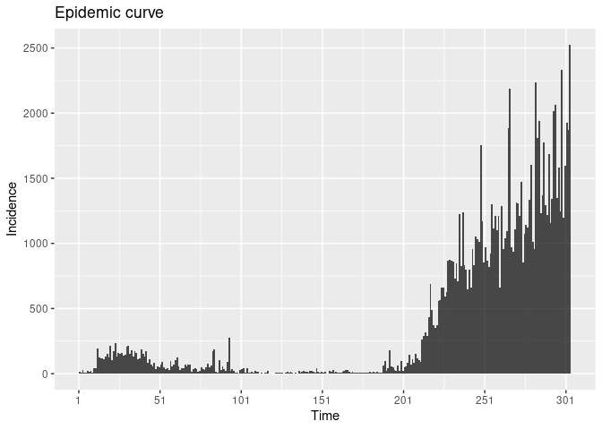
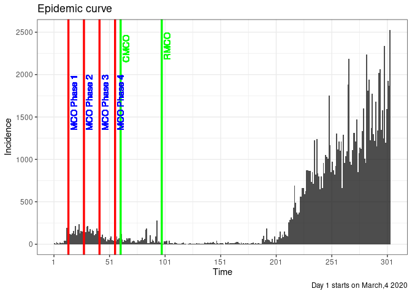
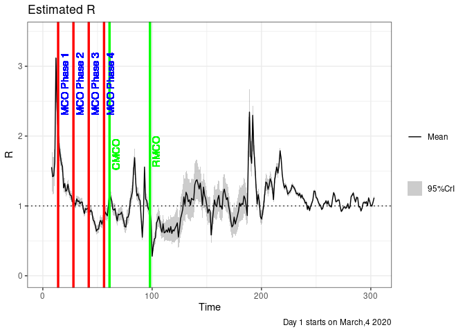
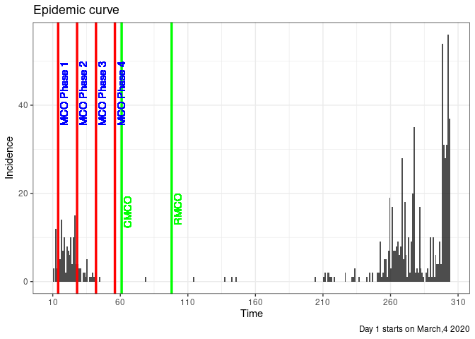
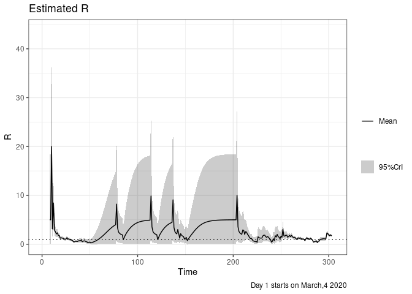

\newpage
---


# Load packages


```r
library(tidyverse)
```

```
## ── Attaching packages ─────────────────────────────────────── tidyverse 1.3.1 ──
```

```
## ✓ ggplot2 3.3.3     ✓ purrr   0.3.4
## ✓ tibble  3.1.2     ✓ dplyr   1.0.6
## ✓ tidyr   1.1.3     ✓ stringr 1.4.0
## ✓ readr   1.4.0     ✓ forcats 0.5.1
```

```
## ── Conflicts ────────────────────────────────────────── tidyverse_conflicts() ──
## x dplyr::filter() masks stats::filter()
## x dplyr::lag()    masks stats::lag()
```

```r
library(incidence)
library(EpiEstim)
library(readxl)
library(lubridate)
```

```
## 
## Attaching package: 'lubridate'
```

```
## The following objects are masked from 'package:base':
## 
##     date, intersect, setdiff, union
```

```r
library(DT)
```


# Read data


```r
excel_sheets('covid19_mph.xlsx')
```

```
##  [1] "Malaysia"   "Kelantan"   "Terengganu" "Pahang"     "Johor"     
##  [6] "Melaka"     "NSembilan"  "Selangor"   "KL"         "Perak"     
## [11] "Kedah"      "Perlis"     "PPinang"    "Sabah"      "Sarawak"   
## [16] "Putrajaya"  "Labuan"
```

```r
mys <- read_excel('covid19_mph.xlsx',
                  sheet = 1)
```

# Analysis for Malaysia


```r
mys2 <- mys %>%
  select(Time = Tarikh, I = Total) %>%
  filter(Time > '2020-03-03' & Time < '2021-01-01')
```

# Calculate R

Using serial interval from Du, Z, et al


```r
mys_parametric_si_du <- estimate_R(mys2, 
                                method = "parametric_si",
                                config = make_config(list(mean_si = 3.96, 
                                                          std_si = 4.75)))
```

```
## Default config will estimate R on weekly sliding windows.
##     To change this change the t_start and t_end arguments.
```

```
## Warning: Unknown or uninitialised column: `dates`.
```

# Date and Time 

To get days from Day 1 of 10 or more cases (4 March 2020) to

- 1st MCO 
- 2nd MCO and the rest

Link https://en.wikipedia.org/wiki/Malaysian_movement_control_order 


```r
difftime(ymd('2020-03-17'), ymd('2020-03-03'), 'days')
```

```
## Time difference of 14 days
```

```r
difftime(ymd('2020-03-31'), ymd('2020-03-03'), 'days')
```

```
## Time difference of 28 days
```

```r
difftime(ymd('2020-04-14'), ymd('2020-03-03'), 'days')
```

```
## Time difference of 42 days
```

```r
difftime(ymd('2020-04-28'), ymd('2020-03-03'), 'days')
```

```
## Time difference of 56 days
```

```r
difftime(ymd('2020-05-03'), ymd('2020-03-03'), 'days')
```

```
## Time difference of 61 days
```

```r
difftime(ymd('2020-06-09'), ymd('2020-03-03'), 'days')
```

```
## Time difference of 98 days
```

```r
difftime(ymd('2020-12-31'), ymd('2020-03-03'), 'days')
```

```
## Time difference of 303 days
```
# Plot incidence


```r
p_I_du <- plot(mys_parametric_si_du, "incid") 
p_I_du
```

<!-- -->

```r
p_I_du + theme_bw() + 
  geom_vline(xintercept = 14, colour = 'red', size = 1.2) +
  geom_vline(xintercept = 28, colour = 'red', size = 1.2) +
  geom_vline(xintercept = 42, colour = 'red', size = 1.2) +
  geom_vline(xintercept = 56, colour = 'red', size = 1.2) +
  geom_vline(xintercept = 61, colour = 'green', size = 1.2) +
  geom_vline(xintercept = 98, colour = 'green', size = 1.2) +
  geom_text(aes(x = 13, label = '\nMCO Phase 1', y=2000),
            colour="blue", angle=90, hjust = 1, text=element_text(size=11)) +
  geom_text(aes(x = 27, label = '\nMCO Phase 2', y= 2000),
            colour="blue", angle=90, hjust = 1, text=element_text(size=11)) +
  geom_text(aes(x = 41, label = '\nMCO Phase 3', y=2000),
            colour="blue", angle=90, hjust = 1, text=element_text(size=11)) +
  geom_text(aes(x = 55, label = '\nMCO Phase 4', y=2000),
            colour="blue", angle=90, hjust = 1, text=element_text(size=11)) +
  geom_text(aes(x = 60, label = '\nCMCO ', y=2500),
            colour="green", angle=90, hjust = 1, text=element_text(size=11)) +
  geom_text(aes(x = 97, label = '\nRMCO', y=2500),
            colour="green", angle=90, hjust = 1, text=element_text(size=11)) +
  labs(caption = "Day 1 starts on March,4 2020")
```

```
## Warning: Ignoring unknown parameters: text

## Warning: Ignoring unknown parameters: text

## Warning: Ignoring unknown parameters: text

## Warning: Ignoring unknown parameters: text

## Warning: Ignoring unknown parameters: text

## Warning: Ignoring unknown parameters: text
```

<!-- -->

# Plot R


```r
p_R_du <- plot(mys_parametric_si_du, "R") 
p_R_du + theme_bw() + 
  geom_vline(xintercept = 14, colour = 'red', size = 1.2) +
  geom_vline(xintercept = 28, colour = 'red', size = 1.2) +
  geom_vline(xintercept = 42, colour = 'red', size = 1.2) +
  geom_vline(xintercept = 56, colour = 'red', size = 1.2) +
  geom_vline(xintercept = 61, colour = 'green', size = 1.2) +
  geom_vline(xintercept = 98, colour = 'green', size = 1.2) +
  geom_text(aes(x = 13, label = '\nMCO Phase 1', y=3.2),
            colour="blue", angle=90, hjust = 1, text=element_text(size=11)) +
  geom_text(aes(x = 27, label = '\nMCO Phase 2', y= 3.2),
            colour="blue", angle=90, hjust = 1, text=element_text(size=11)) +
  geom_text(aes(x = 41, label = '\nMCO Phase 3', y=3.2),
            colour="blue", angle=90, hjust = 1, text=element_text(size=11)) +
  geom_text(aes(x = 55, label = '\nMCO Phase 4', y=3.2),
            colour="blue", angle=90, hjust = 1, text=element_text(size=11)) +
  geom_text(aes(x = 60, label = '\nCMCO ', y=2),
            colour="green", angle=90, hjust = 1, text=element_text(size=11)) +
  geom_text(aes(x = 97, label = '\nRMCO', y=2),
            colour="green", angle=90, hjust = 1, text=element_text(size=11)) +
  labs(caption = "Day 1 starts on March,4 2020")
```

```
## Warning: Ignoring unknown parameters: text

## Warning: Ignoring unknown parameters: text

## Warning: Ignoring unknown parameters: text

## Warning: Ignoring unknown parameters: text

## Warning: Ignoring unknown parameters: text

## Warning: Ignoring unknown parameters: text
```

<!-- -->
# R values


```r
mys_R <- mys_parametric_si_du$R %>%
  datatable()
mys_R
```

```{=html}
<div id="htmlwidget-785dcafad31c4937d7cd" style="width:100%;height:auto;" class="datatables html-widget"></div>
<script type="application/json" data-for="htmlwidget-785dcafad31c4937d7cd">{"x":{"filter":"none","data":[["1","2","3","4","5","6","7","8","9","10","11","12","13","14","15","16","17","18","19","20","21","22","23","24","25","26","27","28","29","30","31","32","33","34","35","36","37","38","39","40","41","42","43","44","45","46","47","48","49","50","51","52","53","54","55","56","57","58","59","60","61","62","63","64","65","66","67","68","69","70","71","72","73","74","75","76","77","78","79","80","81","82","83","84","85","86","87","88","89","90","91","92","93","94","95","96","97","98","99","100","101","102","103","104","105","106","107","108","109","110","111","112","113","114","115","116","117","118","119","120","121","122","123","124","125","126","127","128","129","130","131","132","133","134","135","136","137","138","139","140","141","142","143","144","145","146","147","148","149","150","151","152","153","154","155","156","157","158","159","160","161","162","163","164","165","166","167","168","169","170","171","172","173","174","175","176","177","178","179","180","181","182","183","184","185","186","187","188","189","190","191","192","193","194","195","196","197","198","199","200","201","202","203","204","205","206","207","208","209","210","211","212","213","214","215","216","217","218","219","220","221","222","223","224","225","226","227","228","229","230","231","232","233","234","235","236","237","238","239","240","241","242","243","244","245","246","247","248","249","250","251","252","253","254","255","256","257","258","259","260","261","262","263","264","265","266","267","268","269","270","271","272","273","274","275","276","277","278","279","280","281","282","283","284","285","286","287","288","289","290","291","292","293","294","295","296"],[2,3,4,5,6,7,8,9,10,11,12,13,14,15,16,17,18,19,20,21,22,23,24,25,26,27,28,29,30,31,32,33,34,35,36,37,38,39,40,41,42,43,44,45,46,47,48,49,50,51,52,53,54,55,56,57,58,59,60,61,62,63,64,65,66,67,68,69,70,71,72,73,74,75,76,77,78,79,80,81,82,83,84,85,86,87,88,89,90,91,92,93,94,95,96,97,98,99,100,101,102,103,104,105,106,107,108,109,110,111,112,113,114,115,116,117,118,119,120,121,122,123,124,125,126,127,128,129,130,131,132,133,134,135,136,137,138,139,140,141,142,143,144,145,146,147,148,149,150,151,152,153,154,155,156,157,158,159,160,161,162,163,164,165,166,167,168,169,170,171,172,173,174,175,176,177,178,179,180,181,182,183,184,185,186,187,188,189,190,191,192,193,194,195,196,197,198,199,200,201,202,203,204,205,206,207,208,209,210,211,212,213,214,215,216,217,218,219,220,221,222,223,224,225,226,227,228,229,230,231,232,233,234,235,236,237,238,239,240,241,242,243,244,245,246,247,248,249,250,251,252,253,254,255,256,257,258,259,260,261,262,263,264,265,266,267,268,269,270,271,272,273,274,275,276,277,278,279,280,281,282,283,284,285,286,287,288,289,290,291,292,293,294,295,296,297],[8,9,10,11,12,13,14,15,16,17,18,19,20,21,22,23,24,25,26,27,28,29,30,31,32,33,34,35,36,37,38,39,40,41,42,43,44,45,46,47,48,49,50,51,52,53,54,55,56,57,58,59,60,61,62,63,64,65,66,67,68,69,70,71,72,73,74,75,76,77,78,79,80,81,82,83,84,85,86,87,88,89,90,91,92,93,94,95,96,97,98,99,100,101,102,103,104,105,106,107,108,109,110,111,112,113,114,115,116,117,118,119,120,121,122,123,124,125,126,127,128,129,130,131,132,133,134,135,136,137,138,139,140,141,142,143,144,145,146,147,148,149,150,151,152,153,154,155,156,157,158,159,160,161,162,163,164,165,166,167,168,169,170,171,172,173,174,175,176,177,178,179,180,181,182,183,184,185,186,187,188,189,190,191,192,193,194,195,196,197,198,199,200,201,202,203,204,205,206,207,208,209,210,211,212,213,214,215,216,217,218,219,220,221,222,223,224,225,226,227,228,229,230,231,232,233,234,235,236,237,238,239,240,241,242,243,244,245,246,247,248,249,250,251,252,253,254,255,256,257,258,259,260,261,262,263,264,265,266,267,268,269,270,271,272,273,274,275,276,277,278,279,280,281,282,283,284,285,286,287,288,289,290,291,292,293,294,295,296,297,298,299,300,301,302,303],[1.55503985824834,1.41918221148207,1.43071957732902,1.63912032827482,3.11668375746869,2.39637040972838,2.06019185451713,1.84109475903041,1.71617662045484,1.60454043400733,1.56245432960794,1.25825143449276,1.31980429015758,1.20948796503792,1.22683257064093,1.31042802643365,1.20597959755793,1.15575469153833,1.14716067443974,1.0583342097627,1.08812898747546,1.04235490786334,1.01393633275013,1.10112635728161,1.06191728861358,1.07249785860947,1.03177726796257,1.05451966371242,1.05350435087347,0.954836130757489,0.889967594762555,0.961511822901053,0.949074211098244,0.965793795335414,0.974396564437786,0.912016134276069,0.939948322506715,0.907315837329992,0.799058005291227,0.779203379227739,0.720134333188189,0.639687158303806,0.665461100914857,0.668701848242679,0.761335241791226,0.793249812823479,0.737792027225017,0.795145312900402,0.775862693594298,0.914041657273784,0.884858417727058,0.857927586258829,1.01251085440634,1.18121021876497,1.1267872412629,1.07314350024683,0.953813333198753,0.939338457932888,0.960884236621548,0.866208696026522,0.786646109236284,0.882054323509246,0.875050110424617,0.882192536623462,0.911083535966302,0.844203636991047,0.781191776322819,0.703655431679079,0.69818301037078,0.836641764648018,0.839337829493161,0.902706677127787,1.07281675758663,1.13843715180805,1.20355172962821,1.5182571187728,1.69039643936707,1.33732248201754,1.14461052022585,1.17230726733595,1.09737662202105,1.07610740992425,0.817304101002141,0.551838287767397,0.851156827754208,1.5563701515433,1.09921141456068,1.07714459840109,0.988018058526678,0.940292236606688,0.940971774230722,0.772703457649263,0.280159369002728,0.417044946862357,0.526019498225172,0.541799420153313,0.756453891711638,0.793887888712788,0.84963897646656,0.779437449261154,0.681092294369312,0.622815224967813,0.743607639480843,0.614293729324435,0.623702044638568,0.656275107532538,0.62414091387554,0.684571200836861,0.620723478997277,0.704350434684254,0.606094594608404,0.657364795678337,0.640748607157855,0.68179408842324,0.714161512558685,0.757170245774046,0.553120528535761,0.672847602768519,0.817755579802099,0.879330239953214,0.954337454295982,1.12822612889241,1.01627009087099,1.19534993522953,1.1557933270842,1.06110208492023,1.08669204831281,1.0096323535711,1.10834592316123,1.09347302648047,1.08419200603949,1.30352748868871,1.35837313989203,1.37388806536415,1.31102179804269,1.24265837994506,1.32632787160478,1.19543432268332,1.0100969884523,1.26898818103958,1.1498479012847,1.10036508997209,1.00483497042173,0.897119966190311,0.95335846265355,0.927926653164366,0.583922985225133,0.778416959335161,0.919808940127129,1.0847668409066,1.01233959017632,0.98986953747519,1.09830811530901,1.1509148117356,0.987214730256614,0.999976068126557,0.953006051326154,1.18620983323104,1.23992990028056,1.15698533914785,1.09061225030272,1.11851218467266,0.998322085398101,0.912663243986048,0.782934425463438,0.699177760028895,0.723004120262835,0.839848005016209,0.740575297283774,0.798456642906958,0.856468515343425,0.927510665510986,1.0407231900819,0.996256300540015,1.03484711260827,1.01961411343341,1.14247613627202,1.1023691561306,1.00210373909368,0.862552037200943,1.71572243184303,2.34317427607904,1.73262987688531,1.61010710346812,2.29677262073849,1.81188491404521,1.58158745232302,1.28738482837696,1.02868172272596,1.16099175834675,1.069152699157,0.847311922439362,0.811997954059199,0.894440163337659,1.00641742053692,1.17535964557725,1.34174261478319,1.32473847313835,1.2371289303015,1.29467681319518,1.38768391639706,1.34411128862269,1.25366947023929,1.09037435972492,1.3680026257225,1.46923503949309,1.55663845407809,1.47079887351818,1.57379601413098,1.78828282109954,1.67459120667955,1.45029426114571,1.32716941193899,1.25727392875626,1.29631300876678,1.2533619905634,1.16815852423641,1.18712998529017,1.20576011134739,1.22809843239082,1.29791510306771,1.27549923360181,1.25764309407411,1.22214956391502,1.17204234254219,1.18106571753494,1.14649827311005,1.1778447781346,1.11653382992981,1.1562692143331,1.10650688866052,1.09248193732122,1.03911984376364,1.05187211194832,0.949680223624653,0.997555683380284,0.934574080500642,0.996748172262027,1.0378734403584,1.08413504987778,1.21177658808101,1.20831367640633,1.11784992297698,1.10588497929676,1.05404319807951,1.01748714022292,1.00900574385963,0.950871841633992,0.965173411038376,1.0302439487786,1.03697580001894,1.07114326901837,1.02446880220847,1.06964894107108,1.00179434838097,0.995859152739979,0.986413934285143,1.09867987448645,1.18933460485118,1.15423072512779,1.06065264327346,1.06749656189844,1.0842169339264,1.08461378220645,0.987484768641661,0.921175920859652,0.940545290626612,0.978542595243003,0.987517108516181,0.966778533519322,0.979923029432951,1.03173520684678,0.963358372284956,0.988610144869859,1.1316030453091,1.15534593686238,1.18515150113264,1.10827647106812,1.05535893360757,1.1223947138005,1.11715432812532,0.987297209839152,0.990515414978118,0.927066475032463,0.966602904181243,1.04312684388729,1.05348909859495,1.03861109661313,1.0612593214313,1.00125180961749,1.11549163500628,1.06160586422987,1.00583046920295,0.998359791113856,1.05046192124122,1.1174891084523],[0.155503985824834,0.139162265186362,0.133415288510286,0.135654563580808,0.171567794216545,0.114633942727368,0.0882489231414791,0.0726622141851922,0.0629604138976542,0.0555606912565619,0.0507997720620332,0.042439767562579,0.0424640069768306,0.0391997301264555,0.0386607755666327,0.0389484303024354,0.035844022986502,0.0342605660457586,0.0336094408995493,0.031780231867625,0.0321852780040237,0.0312441010273748,0.0307677524684863,0.0321505311561631,0.0311253469578148,0.0310510443761537,0.0301900987733071,0.0304667601398503,0.0302611218038835,0.0286207666015862,0.0279482883946192,0.0297011993997047,0.0296875750392996,0.0301663300452412,0.0304350354079165,0.0295276125821357,0.0304160134350448,0.0301435496537532,0.0286845107053826,0.0293049591557008,0.0291813158005184,0.0287228013174511,0.0309936133939964,0.0325518966564422,0.0362540591329155,0.0379029421860265,0.0372641246825842,0.0399575554045511,0.0403351807848896,0.0449226966518369,0.0442429208863529,0.0439529617114972,0.0485461797043451,0.0518493739018799,0.0487608527643716,0.0464830048654032,0.0433551515090342,0.0435140137890515,0.0445599394844229,0.0425718348601777,0.0415175937192368,0.0456099432593515,0.0461191902620607,0.0470210201929238,0.0484920836829248,0.0471188522009826,0.0463552035835898,0.0455156861338165,0.0475053367357974,0.0543457225793563,0.0552243747558879,0.0581484487768139,0.0637723367743667,0.0642457252442176,0.0641495227319423,0.0695162180179145,0.067507931157003,0.0541022766190805,0.0479004594527266,0.0480195767029031,0.0456448500556864,0.0448767812085664,0.0389192429048638,0.0333377701585781,0.0453668113520415,0.0625557980149776,0.0475230536067819,0.0462673221947337,0.0440098222256237,0.0432346831014314,0.0438730351944284,0.0402253352684729,0.0252611195897348,0.0356305543963934,0.0439879602498739,0.0471575865292225,0.0587122085724589,0.0608884215712666,0.0636831337067695,0.0614282764775176,0.0588374128012414,0.0588505070717707,0.0678817796794711,0.063359560386877,0.0672555211260315,0.0724734616497522,0.0735557121028938,0.0806774897194603,0.0794754975519038,0.0887398136197514,0.0848702189867179,0.0929654209474922,0.0955171628062181,0.102784326162831,0.10890860965177,0.115467379978929,0.100985530166072,0.118943775655683,0.136292596633683,0.142646201168465,0.149042470348599,0.161175161270345,0.148238228164462,0.15973535410469,0.151763098902497,0.141795730505822,0.142689656480981,0.136138798783216,0.143086843408011,0.140004874601341,0.137692522459607,0.149524857718986,0.145632887026522,0.138783652515751,0.128556264057022,0.120132319931126,0.12057526105498,0.109585284689974,0.0985753724715692,0.11172817941128,0.102436592702581,0.0984196456498106,0.0932965848222954,0.0888281130278653,0.0939372005838243,0.0937347469851801,0.0753841332414887,0.0943969218856175,0.106210387837084,0.115636533780049,0.109163385432345,0.107366425972617,0.113281832506817,0.113957547301547,0.102924250513985,0.104254711958253,0.102172973340304,0.115214884080648,0.114144799417148,0.106060672148051,0.100827138208093,0.101265335096987,0.0943325702252415,0.0908133869903811,0.0859382178314476,0.0847877575200557,0.0910899570995474,0.102603764116582,0.0980915944095422,0.105758165924379,0.112459825606408,0.118755571716511,0.12620622469816,0.121712078673442,0.12368788752765,0.121867195885673,0.128538607801636,0.123248618470355,0.115712972704333,0.107819004650118,0.156623313056341,0.163256687638313,0.115766203167735,0.100828817944049,0.111278997079497,0.0828736869897898,0.0694239838694913,0.0582771729404637,0.0507411274151809,0.0547905886393827,0.051861523629865,0.0460876927797756,0.0468807237357504,0.0512154947670568,0.0553177043265926,0.0595166491778792,0.0615633733271786,0.0578163269445402,0.0531883270411481,0.0527233156296823,0.0524120981643566,0.0487881489017382,0.0449462280932147,0.0406358531544623,0.0453737829632936,0.0446042671314721,0.0428450633335572,0.0384530794710666,0.0373025430203286,0.0367334764267759,0.031817710196144,0.0270012095750127,0.0244268905867132,0.0229202218053675,0.0226449652513593,0.0214697371315251,0.0201018603757817,0.0199299619353327,0.0196585516068782,0.019328751486976,0.0192797472198717,0.018330225572569,0.0175350468439982,0.0167151346691157,0.0159229599017408,0.0156766358446342,0.0151103766584136,0.0150610178245106,0.0143333960209263,0.0144050542116535,0.0138140792879268,0.0135662331010117,0.0131052076998767,0.0131731242066432,0.0124623941096402,0.0129421780744825,0.0125618880733803,0.0131401559392194,0.0134156685797677,0.0136102960514789,0.0141818008784803,0.013672696516679,0.0127349481093732,0.0124873088062753,0.0120448315045307,0.011789872133517,0.0117628821724158,0.0114413496710451,0.0116590988222032,0.0121339600177188,0.0121037680186224,0.0122218987202267,0.0118145910918535,0.0120421148234583,0.0115339413162339,0.0115214874480305,0.0114987278980677,0.012177523231925,0.0124553019755306,0.0118872896204953,0.0111351923426084,0.0111149327100265,0.0111250021462246,0.0110063455010487,0.0103865236044301,0.0100972388556925,0.0103840527916279,0.0107125432227481,0.0107901204835353,0.0106867140366209,0.0108148471478928,0.0111267807435359,0.010678961807924,0.0108868790367691,0.0116684913230353,0.0115109473656151,0.0113579463998325,0.0106732934354209,0.010273353252499,0.0105525330020531,0.0103506792271977,0.00957368563113575,0.00966276030667822,0.00940131060037055,0.00974677439048296,0.0101886124728142,0.0101503700040777,0.00998249280427173,0.010034231359409,0.00965692996746342,0.0102119738856427,0.00977784717957846,0.00943537520412462,0.00942226295259526,0.00969125145436366,0.00991884626294909],[1.26524249421355,1.15957470713929,1.18120574395626,1.38403012227437,2.78944984022256,2.17693013222227,1.89083490319728,1.70141478532068,1.59497856051864,1.49747701273061,1.46446207789537,1.17643501785478,1.23787788148855,1.13386822403313,1.15221928178086,1.23519279673947,1.13674103565408,1.0895722614678,1.08222493273293,0.996954849520771,1.02595347016219,0.982009398844196,0.954521761202439,1.03900624978494,1.0017813613458,1.01249483687307,0.973446841602153,0.995643949245515,0.995021177839811,0.899557384616652,0.836025933124244,0.904172342110376,0.891772133523343,0.90756631557286,0.91565042575836,0.855053800538104,0.881271662052938,0.849189738966975,0.743818958414723,0.722817616533289,0.664068105688141,0.584622814509171,0.606093308579487,0.60641516559564,0.691927604596237,0.720691366334509,0.666554354139597,0.718748769290542,0.698811651532728,0.828104229385742,0.800257760599585,0.773933567444625,0.919585511832676,1.08175984567721,1.03323172957636,0.983960218617503,0.870720461219804,0.855977535201366,0.875521742457071,0.784768482926391,0.707367996198674,0.794914805056034,0.786981955501126,0.792429285141793,0.818508485551604,0.754367985689721,0.692969944790452,0.617266781794553,0.608172535006472,0.733508065267352,0.734581523151465,0.792325931336243,0.95145361952563,1.01598621254478,1.08109012165394,1.3850471514462,1.56065507257348,1.23337202115669,1.05264016234102,1.08006726235873,1.00972595251937,0.989936317926197,0.742794025274043,0.48842543904884,0.764551465309784,1.43616159124914,1.00802896984659,0.98835906327252,0.903631891236254,0.857452116413944,0.856935783555062,0.695864981165319,0.232839826323347,0.350136734824989,0.443339809120351,0.453319094400213,0.645755080939787,0.679031555804981,0.7294029519193,0.663689098096122,0.570660055432244,0.512824129584948,0.616524633017566,0.496411863161811,0.498881129151457,0.521955068928074,0.488351825744023,0.535634803532723,0.474804277349598,0.541242213411434,0.451277235860091,0.487908821894055,0.467366430852742,0.49539262838434,0.516842227749906,0.547967861233133,0.373188097891803,0.460227262203186,0.572745954636168,0.622266412870184,0.684849033919371,0.834667901127613,0.746717037330797,0.902954494958921,0.877642330493072,0.801545111561852,0.825170832414807,0.760593260962277,0.845784702691537,0.836420222057714,0.831243794171612,1.02703139986752,1.08800120012079,1.11538874176783,1.07119981156682,1.01838853104521,1.10055169893401,0.990318217531434,0.826159263073419,1.05946572663655,0.957854009206387,0.915934209515268,0.830314578762159,0.731494119501363,0.77816207662835,0.753335710687252,0.445594753526739,0.604471227379133,0.723488080427713,0.870014726852072,0.809741000808413,0.790672628754149,0.887544755577889,0.938433485553498,0.795834406853387,0.806121846296012,0.763318779733563,0.971171417968489,1.02632275191407,0.958466422649658,0.901966045422575,0.928856766874551,0.822015316848057,0.743379201527983,0.62360289957754,0.542938888589769,0.555576217585589,0.650870668201676,0.560904498028213,0.604743263959301,0.650352451589458,0.709472166226727,0.808162279259732,0.772084948895121,0.806714092516604,0.794839222348889,0.90450911602432,0.874110181593675,0.788218160269367,0.664270172581329,1.42250440486401,2.03410294623039,1.51314491050275,1.41853296601421,2.0838203909677,1.65307496795224,1.44842786759735,1.17568249590663,0.931622350693292,1.05607383986989,0.969909259859559,0.75937899353151,0.722703284013328,0.796865451284325,0.900904660105891,1.06158933427947,1.22377793616771,1.21382911916726,1.13506423405106,1.19338939490045,1.28684571550587,1.25017647652534,1.16711251533511,1.01217348713162,1.28050553528559,1.38310183706596,1.47378614345132,1.39638889699772,1.50152537282554,1.71700384764434,1.61280419797022,1.397850595627,1.27972082258428,1.21274817612417,1.2523055464461,1.21163148988658,1.12908825386753,1.14838584630487,1.16753452332055,1.19050372779398,1.26039947431472,1.2398228017705,1.22350718366542,1.18960556542389,1.14103930897053,1.15053763250231,1.11707155218912,1.1485085535981,1.08861557361854,1.12820618674742,1.07959550569688,1.06605252712662,1.01359101142691,1.02620987174308,0.925409645078514,0.972348889974431,0.910113545429337,0.971158402972387,1.01174384468858,1.05762156160119,1.18413830440843,1.18166252084992,1.0930275802655,1.08154412755091,1.0305663970143,0.994509078990942,0.986081075572891,0.928577884340117,0.942455684997872,1.00659747061996,1.01338694413832,1.04732114399164,1.00144194836298,1.04617549672052,0.979314276283369,0.973403968563084,0.964004067313522,1.07494046368571,1.16504644031609,1.13104823751176,1.03893900164202,1.04582151477366,1.06252065051385,1.06314772228585,0.967231226958921,0.901490733394236,0.920301723926354,0.957657693516903,0.966480749368871,0.945945069934037,0.958839593621713,1.01004099452957,0.942540338269411,0.967386033937711,1.10884739581565,1.13289371541333,1.16299361091317,1.08745472729832,1.0353184185721,1.10180625869417,1.09695835506246,0.96862121368112,0.971666191762062,0.908730710076405,0.947592835176484,1.02325195377101,1.03368753083252,1.01913680336749,1.04168260311256,0.982412946107489,1.09556522748052,1.04252707689992,0.987421448609449,0.979976864326293,1.03155224238985,1.0981320480625],[1.30839929718685,1.19829692148562,1.21856802617209,1.42255090831238,2.83995029204144,2.21098298458157,1.91721592841347,1.72322847726885,1.6139456361328,1.51425799956396,1.47984560548503,1.18926745620768,1.25074253240819,1.14574046543862,1.16394137282592,1.24702840368785,1.14763327865907,1.09998433891329,1.09244350699917,1.00660851749181,1.03573563771571,0.991500846243388,0.963864205328984,1.04878247229532,1.01124452696648,1.02193960937383,0.982626231828371,1.00491169539242,1.00422828038675,0.908251905879577,0.84450110624115,0.913184827711692,0.900776114637445,0.916716019878458,0.924881630684355,0.863997070656338,0.890484203818662,0.85830994431141,0.752468802650752,0.731635670025368,0.672816942004517,0.593186843884867,0.615314896999893,0.616074629331862,0.702700102913699,0.731951491743321,0.677586511943741,0.730582166643053,0.710730569855402,0.841426703548875,0.813364454770766,0.786934016200757,0.934004504843631,1.09723895484577,1.04780018458683,0.997847403058129,0.883638268582222,0.868928442622761,0.888783110270545,0.797393775089894,0.719623981581837,0.80839717706251,0.800597602452924,0.806300654960941,0.832815200868425,0.768223711977917,0.706539770993201,0.630499568057553,0.621923989771913,0.749302459583116,0.75061392197078,0.809237308809985,0.970119556337561,1.03486332358038,1.1000144612341,1.40575104285048,1.58090948454743,1.24959375077934,1.06697725412583,1.09445604247303,1.02339228477565,1.00337085535712,0.754358453885263,0.498171169768952,0.777934837580265,1.45492415542783,1.02222832678637,1.00218809865408,0.916759843744044,0.870325483059621,0.869988575763233,0.707750376330621,0.239943144205929,0.360218848400366,0.455816533600399,0.466634686469058,0.662540118848219,0.69645967209944,0.747672552345366,0.681223138177354,0.587287935939869,0.529277683543159,0.63558431619581,0.513921801971255,0.517350339911291,0.541787149016685,0.508277307670018,0.557489501383939,0.496033189496082,0.565013096867073,0.473570700574019,0.512280869455236,0.49213786348334,0.521984920398688,0.544949064658826,0.577767367697729,0.398135773440855,0.489863598152225,0.607210015138516,0.65856994901334,0.723111854493256,0.876836543527179,0.785336419240518,0.945291078074591,0.917996451680518,0.839126940353945,0.863112306537762,0.796614866954176,0.883948702439798,0.873817297565802,0.868076092949853,1.06771066678456,1.12802749245027,1.15385268285179,1.10697088216353,1.05187761701993,1.13442354197338,1.02107165724926,0.853605280751612,1.09097172331361,0.986700034546677,0.943635999217911,0.856455840109905,0.756179071342894,0.804283689497153,0.779314330792733,0.465701144677233,0.629922694368714,0.752353279207601,0.901822991427289,0.83971863742547,0.820131539396942,0.91885112739146,0.970101799460327,0.824235646247263,0.8348902173794,0.79140038535569,1.00327013779319,1.05833923952446,0.988230733583964,0.930232291181323,0.957318202424863,0.84838902391442,0.768599305914175,0.647140879188091,0.56579951548878,0.579976637936602,0.678500565399353,0.586945624081338,0.632819693408348,0.680255751298406,0.741193283760202,0.842190227392161,0.804860473754439,0.840143118324147,0.827776171291803,0.939583953670412,0.907773830671109,0.819665912476482,0.693191316388977,1.46648072279905,2.08126131297705,1.54670916301575,1.44792494091175,2.11685095328921,1.67775858443755,1.46915369983722,1.19305046030712,0.946666948865315,1.07236304641866,0.985302026822511,0.772956109611681,0.736455178402795,0.811898036161236,0.917188985112268,1.07920652628817,1.24211101603181,1.23109507486151,1.15096112353572,1.20919235518837,1.30261368741677,1.26488124559345,1.18066687931135,1.02440630100049,1.29423472468748,1.39664542103123,1.48684137024117,1.40812586726303,1.51294554245972,1.72829363294334,1.62260167063895,1.40616884782527,1.28724796578688,1.21981255594049,1.25929160020229,1.2182577312258,1.13529172939173,1.15453943439222,1.17360790893556,1.19647935069582,1.2663663900119,1.2454991970958,1.2289401706876,1.19478619435588,1.14597496283147,1.15539878386246,1.12175764803712,1.15318157744857,1.09306256275703,1.13267747285126,1.08388321819538,1.07026365287022,1.01765806802282,1.03029844532954,0.929274804895492,0.97636358089971,0.914008050291217,0.975233468324123,1.01590565565008,1.06184566403645,1.18854434055995,1.18591239180212,1.09698560182665,1.08542565810216,1.03430977139637,0.998172502291096,0.989735798197927,0.932131086709271,0.946076302564348,1.01036693714414,1.01714751448473,1.05111962763822,1.00511329743352,1.04991879739735,0.982898497663685,0.976984075434816,0.96757672075824,1.07872665834045,1.16892187976251,1.13474772153556,1.04240358270714,1.04928015493811,1.06598306039167,1.06657367384852,0.970462791286448,0.904630600784097,0.923530468838337,0.960988953684276,0.969836218992668,0.949267867746826,0.962202303223686,1.01350175477694,0.945860599736718,0.970771240015393,1.11247873134514,1.13647753779574,1.16653142859844,1.09077909691604,1.03851781659581,1.10509392830277,1.10018367123168,0.971602852551123,0.974675358667224,0.911657085614643,0.950626955828459,1.02642483443261,1.03684901034752,1.02224608425043,1.04480859251634,0.985420700602169,1.09874774935075,1.04557409873424,0.990361140109883,0.982912267242064,1.03457222284932,1.10122426321668],[1.44752181855006,1.32300551944351,1.33861589886379,1.54569806578139,2.99931128255575,2.31808703124232,2.00000201212977,1.79157775250188,1.67330124380453,1.56672397080671,1.52789693217695,1.22937211325822,1.29091993245236,1.18282238943651,1.20053964899578,1.28395161832567,1.18161350697473,1.13246547380401,1.12431609589298,1.03672890902908,1.06625084731405,1.02111438151804,0.993017654742043,1.0792739715624,1.04076109824918,1.05139411462194,1.01125703914532,1.03381334830237,1.03293867886913,0.9353790131886,0.870960689976006,0.941315463300416,0.928885098654006,0.945279344729076,0.953699382193824,0.891930180894918,0.919258130195752,0.886806467098482,0.779528063419839,0.759242348320583,0.700242896902463,0.620086742877049,0.644302249289323,0.646467541426385,0.736578728555587,0.767366291996235,0.712327529061144,0.767841983755012,0.748289496634493,0.883354010832336,0.854628749288666,0.827886880523972,0.9793578223564,1.14583715563995,1.09352642625422,1.04143613125901,0.92422372457105,0.909633981653001,0.93046539032971,0.83712697311309,0.758259076001697,0.850877436838626,0.84351737489129,0.850038479313033,0.877924148822374,0.811962756117005,0.749446066972889,0.672444192319333,0.665581073606131,0.799373098386508,0.801458951289494,0.86283542874988,1.02914205421245,1.09447060946119,1.15968480751771,1.47080881612341,1.64438646873665,1.30044429582521,1.11194828565079,1.13957111305436,1.06625442453017,1.04550807415753,0.790727635493467,0.529001415982434,0.820133956574044,1.51373253847694,1.0667952574905,1.04558721019255,0.95798847961298,0.910780975877793,0.911019966503422,0.745204873265478,0.262732642140538,0.392491660976391,0.495719859718899,0.509290659247835,0.716068963580958,0.752015149964293,0.805862401242422,0.737172368300575,0.640538017455154,0.582176031943187,0.696766377321798,0.570454762537071,0.577118444472243,0.606048302563862,0.573080530956647,0.628567072806013,0.565431661030937,0.642640575272453,0.546899059588607,0.59250405582383,0.574001574784957,0.609943888983968,0.638002988491471,0.67642524989887,0.482079724466164,0.589267412031849,0.722174910685513,0.779382637636794,0.850035640881477,1.01574260886529,0.91275043544969,1.08408768372221,1.0501364061321,0.962335519943873,0.987352025181237,0.914781725590601,1.00877641209801,0.996070376867591,0.988419440401087,1.19980306671292,1.25751655702279,1.27790868293456,1.2221750391797,1.15965967953343,1.24313315195134,1.11980923773509,0.941977634349775,1.1919487804794,1.07919824943352,1.03248031260773,0.940433324523862,0.835716456665331,0.888430340454909,0.86310199287658,0.531465602631428,0.712840253383169,0.846119112777709,1.00469487310296,0.936729091370532,0.915493179254688,1.01992754475969,1.07214027625741,0.915982775898339,0.927823326214326,0.882247192093926,1.10660030558667,1.16115125848936,1.08379259831997,1.0210187000522,1.04864697304327,0.933180768515012,0.849880423793075,0.723384880558586,0.640276455493153,0.659659965963315,0.768556097977556,0.672267578625289,0.724810179239148,0.778174391209748,0.844891346902132,0.953048843069075,0.911687412907304,0.948954922239944,0.934986260230508,1.05335304565682,1.01692726635329,0.921820923501765,0.787590464124502,1.6076458065434,2.23109071761633,1.6532053206164,1.54100076503393,2.22076873691551,1.75532014597548,1.53422450887739,1.24761289175141,0.994017842992458,1.12358132476258,1.03373062394528,0.815787618342024,0.779904920837931,0.859383760364934,0.968574402487402,1.13468754759508,1.2997215173538,1.28529707620844,1.20085059585392,1.25873615891721,1.35198203983573,1.31089034967994,1.2230680441577,1.06269769660771,1.3371311887387,1.43890894904498,1.527529632556,1.44468324270545,1.54847776834516,1.76337128071055,1.65302206055918,1.43199203758797,1.31061305782252,1.2417394942048,1.28096818909125,1.23881482764954,1.15453790820519,1.17362732931796,1.19244302902297,1.21500670451304,1.28485960040039,1.26308828843298,1.24577188305461,1.21083422528974,1.16126352688091,1.17045452085462,1.13627061843885,1.16765158823217,1.10683296012834,1.14652082156249,1.09715836421542,1.08330130140295,1.03025074201009,1.04295725472521,0.941245016790628,0.988796077207682,0.926070816875734,0.987854079015551,1.02879347778783,1.07492426414235,1.20218119181857,1.19906368813346,1.10923417449721,1.09743699451595,1.04589426840802,1.00951036593843,1.00104708178633,0.943129959407112,0.95728408848864,1.0220339586622,1.02878646667615,1.06287458197078,1.01647541947922,1.06150221401066,0.993990883962177,0.988063998549866,0.978633998287042,1.09044192063822,1.18091010004024,1.14619078164487,1.05312098117555,1.0599787748711,1.07669263776647,1.07716996156614,0.980459457144898,0.91434547680244,0.933520679323459,0.971295944845968,0.980218020319783,0.959549151938999,0.972607001872159,1.02420866416775,0.956134175332864,0.981245436171856,1.12371105928795,1.14756122410098,1.17747103417205,1.10105888997438,1.0484116118589,1.11525922720244,1.11015558606014,0.980823100590018,0.983980968652138,0.920708184347398,0.960011069799826,1.03623676769273,1.04662512489253,1.03186068860203,1.0544742079235,0.994721497272041,1.10858688283446,1.0549945458813,0.999450426034221,0.991988517789527,1.04390912827215,1.11078304848327],[1.54985947496189,1.4146361514835,1.42657470779787,1.63537956715895,3.11353615800982,2.3945427627573,2.05893193543795,1.84013893103367,1.71540675070314,1.60389917646351,1.56190381642376,1.25777431406343,1.3193488990961,1.20906450122524,1.22642649306773,1.31004217266319,1.20562449848692,1.15541617528512,1.14683246204938,1.05801612210439,1.0878116726446,1.04204274871637,1.01362513539373,1.10081346421206,1.0616132040748,1.07219820938659,1.03148282592384,1.05422626708309,1.05321462237359,0.954550181288812,0.889675051841659,0.961206015828794,0.948764681039314,0.965479734216998,0.974079705832682,0.911697490159636,0.939620263178643,0.906982041719952,0.798714793540155,0.778836034562815,0.71974020936887,0.639257312419493,0.664979990653511,0.668173721967263,0.760759857926631,0.792646203690657,0.7371647479817,0.794476098915571,0.775163830253161,0.913305819345041,0.884121145053793,0.857177110301136,1.01173508980396,1.18045166047746,1.12608395654787,1.07247244076855,0.953156517452513,0.938666627523293,0.960195518567011,0.865511365431498,0.78591582499544,0.881268303519943,0.874240012347632,0.881357267811637,0.910223356144596,0.843327159719283,0.780275076130637,0.702674287054203,0.697105863548122,0.835465347982542,0.83812697498996,0.901458427646353,1.07155339854843,1.13722884814372,1.20241219468381,1.51719627435884,1.68949785532509,1.33659297154227,1.14394239900296,1.17165167973225,1.09674382845544,1.07548364387421,0.816686418322593,0.551167097037408,0.850350943865283,1.55553212188992,1.09852662354676,1.07648222032601,0.987364684316838,0.939629675407085,0.940289998536658,0.772005554087245,0.279400496395197,0.416030679044057,0.52479385496487,0.540431855721707,0.754935451438653,0.792331789580274,0.848048423027215,0.777824302447755,0.67939878623118,0.620962592175863,0.741543085848015,0.612116761373229,0.621286267702541,0.653609259073931,0.621253762904511,0.681404511451027,0.617334862304421,0.70062723859055,0.602137827972204,0.652987595691011,0.636008622237213,0.676635995897838,0.708633071180747,0.751308866739655,0.546987032855314,0.665851901357494,0.810196359462569,0.871628961351391,0.946589927493717,1.12056047243595,1.00907165987659,1.18824233549484,1.14915766618979,1.05479272840882,1.08045311289047,1.00352000628627,1.10219456432707,1.08750360357947,1.07836862092805,1.29781474217607,1.35317220498854,1.36921781299553,1.30682220781029,1.23878932133216,1.32267587064993,1.19208743978068,1.00689214739741,1.26571065238369,1.14680741042098,1.09743217821006,1.00194899332986,0.894189910973062,0.950274941557658,0.924772355693492,0.580682192131053,0.774604533091853,0.915724146190831,1.08066065407086,1.00841850854063,0.985990414082135,1.09441587051888,1.1471558451806,0.983640178382123,0.996355309421064,0.949357184685598,1.18248170619589,1.23642903789898,1.15374610268231,1.08750667155107,1.11545762931489,0.995352465905526,0.909652927735051,0.779792365323771,0.695753420914614,0.719182320795214,0.835673372505463,0.736248978982227,0.793792191365204,0.851551343301176,0.922447254458726,1.03562607554154,0.991304209308709,1.02992346271881,1.01476293990667,1.13765919458231,1.09777936923118,0.997653480895032,0.858063762118584,1.71095889689325,2.3393838245763,1.73005224182306,1.60800287811388,2.29497570927412,1.81062155273628,1.58057177683162,1.28650557401868,1.02784755137769,1.16012996294554,1.06831426504303,0.846476455764353,0.811095912543473,0.893462823258852,1.0054040901826,1.17435521746938,1.34080115857603,1.32389746435132,1.23636676558922,1.29396119710728,1.38702411299859,1.34352103552824,1.25313237772214,1.08986959834924,1.36750100731125,1.4687836862619,1.55624538121142,1.47046377684844,1.57350130558997,1.78803131081822,1.67438969580386,1.45012669737129,1.327019553903,1.25713465223416,1.29618115142119,1.25323940251622,1.16804322090769,1.18701845671486,1.20565327623164,1.22799703032629,1.29781964130465,1.275411426661,1.25756159921895,1.22207336139502,1.17197023539795,1.18099635804551,1.1464318909393,1.1777805840336,1.11647249599632,1.15620939444697,1.10644940234152,1.0924257835328,1.03906475071191,1.05181712123653,0.949625710649983,0.997499713805435,0.934517798412474,0.996690430522582,1.03781563678483,1.08407809558705,1.21172126384451,1.208262105578,1.11780156298022,1.10583797871777,1.05399731860526,1.01744160320877,1.00896003408264,0.95082595274431,0.965126464928908,1.03019631223726,1.03692870794684,1.07109678483642,1.02442338567579,1.06960375134118,1.00175008422055,0.99581472088109,0.986369254030096,1.09863488382815,1.18929112576677,1.15418991677431,1.06061367616535,1.0674579853697,1.0841788834537,1.08457655270165,0.987448353171864,0.921139028338452,0.940507075995677,0.978503503854168,0.987477809323183,0.966739157031342,0.979883243969853,1.03169520808367,0.963318913312359,0.98857018193672,1.13156293912746,1.15530770844797,1.18511521822024,1.10824220808724,1.05532559859992,1.12236164303135,1.11712236118553,0.98726626510609,0.990483994161317,0.927034695900927,0.966570143731155,1.04309367207064,1.05345649916114,1.03857911492226,1.0612276969692,1.0012207632209,1.115460472695,1.06157584498636,1.00580096594048,0.998330149638801,1.05043211851694,1.11745976199123],[1.65691195819355,1.51040424788721,1.51830575065148,1.72846534603991,3.23062519437234,2.47266152830352,2.11900828441784,1.88956982982988,1.75821276785462,1.64165786473722,1.59641161264607,1.28661064776238,1.34819222583426,1.23569192268696,1.25268282647565,1.33648381364158,1.22995859307483,1.17867489116872,1.16964746699817,1.07959276188457,1.10966122126826,1.06325514826446,1.03451577344476,1.1226376566345,1.08274199488857,1.09327495330673,1.05197652400605,1.0749061457929,1.07375418812504,0.973981533658131,0.90865559799266,0.981374821418454,0.96892590421525,0.985965887274491,0.994748338468528,0.931754733650088,0.960280897277419,0.927461337385791,0.818213814097377,0.798763971115085,0.73959614105587,0.658819009371202,0.686095508049573,0.690360462487983,0.785464547044528,0.818475358426456,0.762572752455948,0.821719157222606,0.802674089286015,0.943927192572014,0.914284412663507,0.887150228493698,1.04481825031442,1.21575639453006,1.1592814204117,1.10411936148755,0.982686964084102,0.968310590758085,0.990552330793277,0.89453028329197,0.814237092172044,0.912374402563076,0.905699793992473,0.913436105826296,0.943305280478316,0.875489116508766,0.811938249036816,0.733797204395038,0.729610848615772,0.872628115030835,0.87589685736223,0.941217308277133,1.11511435394746,1.18108658862224,1.2461764971169,1.56454902337813,1.73542687602501,1.37340543976673,1.17654444783524,1.20432877608504,1.12780902224635,1.10602678930821,0.84320724991123,0.573943539406318,0.88130124197946,1.59809424057926,1.13088109530342,1.10797994174507,1.0173354098473,0.969081257444232,0.970180397919757,0.799441287111172,0.296758987345579,0.440492742746978,0.554983250704845,0.572817629087938,0.795183762634081,0.834064517460324,0.891681876482599,0.819944253339427,0.719800757951683,0.66143523937897,0.788198719396897,0.65576012193984,0.667652865945324,0.703596638123716,0.672054970985024,0.737124370935474,0.672322709931596,0.762003064447833,0.660978758300852,0.717456096361136,0.702331180691651,0.748024347040267,0.784296662606915,0.83152912379473,0.617480352832397,0.748807264500382,0.905101183119534,0.970887723089076,1.05019837428255,1.23235715740894,1.11194650592995,1.2988672816461,1.25421949215685,1.15299356278018,1.1792336199104,1.09782262014846,1.20121232142159,1.18437077583734,1.1736187693072,1.40102623192626,1.45356158562766,1.46477750863871,1.39529151141803,1.3214402473786,1.40554222427058,1.26741160510071,1.07472344578071,1.34245531379516,1.21718365378517,1.16505322568059,1.06609117604864,0.955330084159465,1.01492592720222,0.989313558715064,0.632848887658761,0.839839084549169,0.989047229399746,1.16036374744619,1.08367678846205,1.06001833614541,1.17244671277146,1.22559254658535,1.05455097137815,1.068182738444,1.01978826465054,1.26175613575979,1.31489292214913,1.22664760241774,1.1568210094637,1.18504818828882,1.06022682339972,0.97216520575501,0.8390597026936,0.754347400680126,0.782183595152689,0.906590641835223,0.804168741607711,0.867020377414462,0.929404488839124,1.00461236802924,1.1228429709111,1.07542868893464,1.11537371573621,1.09895536109766,1.22634972250416,1.18280907605752,1.0775367399503,0.932622632237631,1.81860722216806,2.45112623453055,1.80924477964181,1.67691978126486,2.37081775118571,1.86707252569239,1.62784323071692,1.3261983123376,1.06243630188005,1.19746277477973,1.1036608253683,0.877925525281276,0.843107724769215,0.928431223878386,1.04315585848986,1.21493685552004,1.38273745626487,1.36326310479276,1.27257644456826,1.32983738549378,1.42266654758527,1.37668879665656,1.28368541495303,1.11750078680564,1.39832724905851,1.49906910823423,1.58531878385837,1.4965492122466,1.5987929943945,1.81292018603226,1.69594068219453,1.46841382037753,1.34356240304752,1.27265653538015,1.31151408820485,1.26777551784389,1.18165344585665,1.20051106174288,1.2189607305419,1.24107961977094,1.31086654081698,1.28781445850679,1.26942546574676,1.23338183247084,1.18274255259001,1.19160130386689,1.15665356307109,1.1879679885745,1.12616783820502,1.1659523960604,1.11579274593886,1.10160135869276,1.047928887311,1.06072702252522,0.958056004626308,1.00625427584197,0.943015989754613,1.00557931992864,1.04689038993235,1.09328374842532,1.22131167408596,1.2175074460888,1.12641295307263,1.11428172762436,1.06214211344448,1.0254142735291,1.01691457662369,0.958563699307125,0.973011556535685,1.03840200917779,1.04511379718029,1.07936128255272,1.03241267529764,1.07774640572724,1.00954955938752,1.00360587070725,0.994145163280205,1.10686878293861,1.19771171205428,1.16222618242785,1.06814182637923,1.07497229571191,1.09169975033591,1.09201701805131,0.994470382749643,0.927966147491787,0.947528243242767,0.985746631176138,0.994773355715896,0.973964989844679,0.987195685904786,1.03921814590773,0.970539554064322,0.995931289014003,1.13945131060234,1.16308897588882,1.19279241519095,1.1154567012378,1.06226991604051,1.12949414913033,1.12411822223201,0.993737585469377,0.997015608695449,0.933390122507408,0.973159025592158,1.04998075866521,1.06031753484724,1.04532664059061,1.06800996032697,1.0077482775173,1.1223624163636,1.06818445785148,1.01217835013093,1.00469875152928,1.05698222551656,1.12416317710675],[1.81935207364622,1.65557528077505,1.65701027653264,1.86845026298056,3.40415412704463,2.58799217156631,2.20746551502145,1.9622214795144,1.82103371575095,1.6970102672749,1.64694091234823,1.3288629216371,1.39041943474046,1.27467994437932,1.29110894148845,1.37514383595864,1.26553719580237,1.21267975778895,1.20299740785564,1.1111449317582,1.14160473061517,1.09427377642794,1.06506998647245,1.15453755244332,1.1136273136747,1.12407824183287,1.08193267594308,1.10512843776927,1.10376871468498,1.00239575867265,0.936431977718914,1.0108819577568,0.998428146852429,1.01594286598601,1.02499233590339,0.961122126582699,0.990531486155172,0.95746034270627,0.846817940872206,0.828024142205486,0.768796126428694,0.68765372973261,0.717248432218235,0.72313057393143,0.821933088133025,0.856607121509773,0.800137274847822,0.86199123613553,0.843378734362563,0.989166649587534,0.958867314475064,0.931481129899687,1.09366343601763,1.26776901680133,1.20817328653758,1.15072866192438,1.02622887743152,1.01204017067908,1.03533466633098,0.937402302043543,0.856159335913453,0.958392689654559,0.952265973175173,0.960933634799964,0.992286062328067,0.923173350484906,0.858970782813581,0.780158137551502,0.778116360663759,0.927994017062493,0.932192159743154,1.00043402459116,1.17982346533317,1.24613267696388,1.31097610805911,1.6343818665571,1.80294856781875,1.4275396580236,1.224522826596,1.25239477796357,1.17351949249447,1.1509717039024,0.882356742215131,0.607794939038934,0.927127798438581,1.66067476360477,1.17853040665633,1.15436054896251,1.06150501247168,1.0125190687844,1.01428059507952,0.840037182151846,0.322964283406141,0.477330932030105,0.600403390224083,0.621629218326391,0.855547358212777,0.896624256718985,0.957031074761867,0.883154521660883,0.780673579911746,0.722672550589177,0.858673639114979,0.722091893371204,0.738294671494969,0.779857082065062,0.749853552411527,0.822455531137489,0.756973617215071,0.856388963416045,0.752116735647332,0.817381279720357,0.805529713892684,0.859200031164205,0.902234227700864,0.956569207274221,0.729030782212576,0.879698415652665,1.05409001329956,1.12636384398781,1.2119938821497,1.40576670129244,1.27176094463549,1.46965567776867,1.41622704221666,1.30460098573206,1.33155524376055,1.2435015536731,1.35372777702632,1.33349270679942,1.32017365338121,1.55883231538216,1.60646068610089,1.60985492790156,1.52939859578007,1.44663747795578,1.5306900280306,1.3812139943152,1.17752122765854,1.45818502351466,1.32336757367001,1.26709901289202,1.16305885970414,1.04805604237495,1.11295192403068,1.08729912791834,0.713200408126011,0.939916733423531,1.10119915179143,1.28171807620829,1.19833649992874,1.17284037009366,1.29104262119138,1.34455063777105,1.16238760889957,1.17741333791108,1.12705906065943,1.38186711640018,1.43346283192929,1.33678974354818,1.26158607819679,1.29012596381622,1.15838524628462,1.06699615984972,0.929446481780651,0.844237613797653,0.87906916586909,1.01543658124267,0.908963760754601,0.980005889472846,1.04945568019199,1.13110125077207,1.25664417956074,1.2045454484854,1.24634734898364,1.22800105617638,1.36180040445799,1.31262165872678,1.19972283303146,1.04722389500851,1.98121367511826,2.61801712437037,1.92734333165724,1.77946710764937,2.48282378402872,1.95032072566172,1.69748579682397,1.38471844137258,1.11354196348038,1.25256016326257,1.15586337804367,0.92451762845957,0.890617724945568,0.980316139184518,1.09910246805934,1.27493900202613,1.44458563756377,1.42125065383631,1.32589657207869,1.38260232087948,1.47500480877431,1.42535475002195,1.32850414264217,1.15806421578039,1.44348160052219,1.54336427041722,1.62777634889615,1.53461492769135,1.6356517651793,1.84912993456233,1.72726811511799,1.49499125009161,1.36760203777444,1.29521038671262,1.33378419490887,1.28888440902067,1.20141862936063,1.22010097040775,1.23827673812661,1.26006340578526,1.32978944486661,1.30579878753508,1.28662400377464,1.24977286714484,1.19835568622424,1.20696924267011,1.17146533374068,1.20272695066394,1.14021431265912,1.18006500680972,1.12932665011445,1.11489176737805,1.06076954684711,1.07363335681685,0.970271591014228,1.01893870311166,0.9553320939842,1.01845983846907,1.06003839825074,1.10661871191348,1.23519755151506,1.23089087370481,1.13887920439027,1.12650462365714,1.07393312374266,1.03695710897582,1.02843160965316,0.96976912766716,0.984430656893076,1.05028345291255,1.05696472081735,1.09132547209015,1.04397922683041,1.08953323094229,1.02084118810027,1.0148857910826,1.00540355615258,1.11878655777582,1.20989564095987,1.17385292963697,1.07903462410811,1.085844556825,1.10258060100133,1.10278088370867,1.00463096240048,0.937847084609758,0.957690465924633,0.996229581009347,1.00533205108549,0.984423515999638,0.997779467400315,1.05010509825616,0.980990742903871,1.00658536684816,1.1508641650197,1.17434473644013,1.20389533789331,1.12589071928199,1.07231375928343,1.13980830661769,1.13423402707736,1.00309712235252,1.00646265047878,0.942584265887675,0.9826906013354,1.0599420053475,1.07024038639782,1.05508520135513,1.07781792418495,1.0171888206409,1.13234181806012,1.07774002801908,1.02140043653432,1.01390842467989,1.06645327936065,1.13385405705803],[1.87427317828888,1.70462144878876,1.70378576518886,1.91546712629273,3.46180453726235,2.62619675376447,2.23670865602213,1.98620651751548,1.84174971231644,1.71524801383599,1.66357506058802,1.34277924822829,1.40431861484725,1.28751418404951,1.30375353592794,1.38785600683406,1.27723613569619,1.22386086022132,1.21396159988619,1.12152121535934,1.15210775889051,1.10447437145237,1.0751193926535,1.16502459115591,1.12378128449967,1.13420374415278,1.09178096606512,1.11506270946247,1.11363400993344,1.01173988571717,0.945571732995266,1.02058915912927,1.0081353007419,1.02580603655068,1.03494336226025,0.970789272282521,1.00048929241798,0.967338842177843,0.856247464496866,0.83767669405609,0.778440287377461,0.697194218557891,0.727562928213877,0.733989739038685,0.834012644298207,0.869238421223124,0.812594361529914,0.875344822961322,0.856885182647419,1.00416066371654,0.973648802209283,0.946186356498353,1.10984467510847,1.28497131106124,1.22433936739177,1.1661402671204,1.04063873741166,1.02651723390583,1.05016055228882,0.951611660362759,0.870074221190938,0.973660577704663,0.967721824186817,0.976702381333115,1.00854674223576,0.939020040072945,0.874622907374325,0.7956195503005,0.794314463565683,0.946460585912485,0.950974945095698,1.0201807492727,1.20135913990705,1.26775450452599,1.33248898804411,1.65749561765178,1.82524428225616,1.44541860500939,1.2403776718885,1.26827284360718,1.18862332654632,1.16582323503607,0.895324315828117,0.619065281919146,0.942341797332958,1.68134106802908,1.19428537819872,1.16969428572974,1.07611720444831,1.02689753682779,1.02888213347302,0.853507926597646,0.331791077637604,0.489716626076632,0.615663799706877,0.638050755559715,0.875781214907382,0.917586745824618,0.978913341954396,0.904352459461446,0.801147690142994,0.743333487627914,0.882422094385256,0.744545454642013,0.76224959462109,0.805742597063627,0.776334547279312,0.851500456815297,0.785895894506861,0.888613001435061,0.783392316833474,0.851689699159082,0.841060095706271,0.897500068189778,0.942889155495911,0.999672484514987,0.767894232564366,0.92520804302563,1.10570838504048,1.18014509191864,1.26784072884281,1.46533632429517,1.32672014223572,1.52812809920252,1.47164596489602,1.35650646250098,1.38366084187268,1.2933993730958,1.40585739724228,1.38444249547835,1.37022724682075,1.6124832184836,1.6582972510984,1.65892461182767,1.57470679852965,1.4889131635045,1.5728558899856,1.41956846088755,1.21224536105018,1.49713473034762,1.35911891384812,1.30146177579869,1.1957543391401,1.07939500409362,1.14607608659867,1.12044088722558,0.740664472204796,0.974024345422639,1.13933941489137,1.32285071006194,1.23721807370049,1.21110789185429,1.33118779504565,1.38475537803516,1.19890613488364,1.21440392456677,1.16342650541509,1.42243235177371,1.47343002312243,1.37391060805158,1.2969052904948,1.32552458482327,1.19150304579226,1.09905251661602,0.960119288382599,0.874873230701271,0.912146610152487,1.05254493297278,0.944826717941033,1.0186717975916,1.0905223322628,1.17431811233228,1.30224516800285,1.24856463885434,1.29095574903721,1.27195281843976,1.40781303807774,1.3567073704934,1.24127548445186,1.08633533141563,2.03600837499154,2.67378510544162,1.96676250302205,1.81363878666602,2.51993624710214,1.97787424840257,1.7205188965385,1.404083761426,1.13048147590208,1.2708070511225,1.17316074863456,0.939992561897373,0.90641863548615,0.99756878809804,1.11768863375148,1.29483785390613,1.46505736899989,1.44042709562847,1.34352484457179,1.40003093347871,1.49227165801379,1.44140040455344,1.34327862807061,1.17144369925961,1.45835033262183,1.55793321526808,1.64172454403668,1.54711316035745,1.6477414479077,1.86099109914521,1.73752337987299,1.50369017362154,1.37546962852308,1.30259117506754,1.34106980263216,1.29578914643206,1.20788405147331,1.22650792972542,1.24459283249808,1.26626939476457,1.33597323164486,1.31167466374331,1.29224213189481,1.25512661402739,1.20345515411987,1.21198796595583,1.17630223761186,1.20754581170611,1.14480064120765,1.184672192738,1.13374496099694,1.11923046424866,1.0649617647465,1.07784685922016,0.974260594241865,1.02308054659366,0.959354461313226,1.02266608238052,1.06433152828238,1.11097220405307,1.23972927428886,1.23525790425849,1.14294709111633,1.13049293103166,1.07778072798791,1.04072398411679,1.03219017659813,0.973426581231323,0.98815792746046,1.05416114100371,1.06083227580598,1.09522955938803,1.04775375403485,1.09337919452352,1.02452596963525,1.01856683908438,1.00907771503024,1.12267496309591,1.21386985709953,1.17764512294483,1.08258773146245,1.08939083595857,1.10612945475374,1.10629141406127,1.00794525615073,0.941070765166218,0.961006027592556,0.999649649775792,1.00877680140363,0.987835770097178,1.00123256240619,1.05365672850631,0.984400648043676,1.0100613615116,1.1545866146234,1.1780154069695,1.20751558391568,1.12929292830815,1.07558888851917,1.14317110715429,1.13753196647713,1.00614906215759,1.00954319989348,0.94558283794099,0.985799147886467,1.06319024647829,1.07347592603746,1.05826713896174,1.0810157587605,1.02026710703492,1.13559513519301,1.08085524826538,1.02440715422069,1.01691116777327,1.06954096633796,1.13701294219736]],"container":"<table class=\"display\">\n  <thead>\n    <tr>\n      <th> <\/th>\n      <th>t_start<\/th>\n      <th>t_end<\/th>\n      <th>Mean(R)<\/th>\n      <th>Std(R)<\/th>\n      <th>Quantile.0.025(R)<\/th>\n      <th>Quantile.0.05(R)<\/th>\n      <th>Quantile.0.25(R)<\/th>\n      <th>Median(R)<\/th>\n      <th>Quantile.0.75(R)<\/th>\n      <th>Quantile.0.95(R)<\/th>\n      <th>Quantile.0.975(R)<\/th>\n    <\/tr>\n  <\/thead>\n<\/table>","options":{"columnDefs":[{"className":"dt-right","targets":[1,2,3,4,5,6,7,8,9,10,11]},{"orderable":false,"targets":0}],"order":[],"autoWidth":false,"orderClasses":false}},"evals":[],"jsHooks":[]}</script>
```

```r
write_csv(mys_parametric_si_du$R, 'R_Malaysia.csv')
```


# Analysis for Kelantan


```r
kel <- read_excel('covid19_mph.xlsx',
                  sheet = "Kelantan")
```


```r
kel2 <- kel %>%
  select(Time = Tarikh, I = Total) %>%
  filter(Time > '2020-03-03' & Time < '2021-01-01')
```

# Calculate R

Using serial interval from Du, Z, et al


```r
kel_parametric_si_du <- estimate_R(kel2, 
                                method = "parametric_si",
                                config = make_config(list(mean_si = 3.96, 
                                                          std_si = 4.75)))
```

```
## Default config will estimate R on weekly sliding windows.
##     To change this change the t_start and t_end arguments.
```

```
## Warning in estimate_R_func(incid = incid, method = method, si_sample = si_sample, : You're estimating R too early in the epidemic to get the desired
##             posterior CV.
```

```
## Warning: Unknown or uninitialised column: `dates`.
```

# Plot indence


```r
kel_p_I_du <- plot(kel_parametric_si_du, "incid") 
kel_p_I_du + theme_bw() + 
  geom_vline(xintercept = 14, colour = 'red', size = 1.2) +
  geom_vline(xintercept = 28, colour = 'red', size = 1.2) +
  geom_vline(xintercept = 42, colour = 'red', size = 1.2) +
  geom_vline(xintercept = 56, colour = 'red', size = 1.2) +
  geom_vline(xintercept = 61, colour = 'green', size = 1.2) +
  geom_vline(xintercept = 98, colour = 'green', size = 1.2) +
  geom_text(aes(x = 13, label = '\nMCO Phase 1', y=50),
            colour="blue", angle=90, hjust = 1, text=element_text(size=11)) +
  geom_text(aes(x = 27, label = '\nMCO Phase 2', y= 50),
            colour="blue", angle=90, hjust = 1, text=element_text(size=11)) +
  geom_text(aes(x = 41, label = '\nMCO Phase 3', y=50),
            colour="blue", angle=90, hjust = 1, text=element_text(size=11)) +
  geom_text(aes(x = 55, label = '\nMCO Phase 4', y=50),
            colour="blue", angle=90, hjust = 1, text=element_text(size=11)) +
  geom_text(aes(x = 60, label = '\nCMCO ', y=20),
            colour="green", angle=90, hjust = 1, text=element_text(size=11)) +
  geom_text(aes(x = 97, label = '\nRMCO', y=20),
            colour="green", angle=90, hjust = 1, text=element_text(size=11)) +
  labs(caption = "Day 1 starts on March,4 2020")
```

```
## Warning: Ignoring unknown parameters: text

## Warning: Ignoring unknown parameters: text

## Warning: Ignoring unknown parameters: text

## Warning: Ignoring unknown parameters: text

## Warning: Ignoring unknown parameters: text

## Warning: Ignoring unknown parameters: text
```

<!-- -->

# Plot R

Wide 95% CI due to small number of cases


```r
kel_p_R_du <- plot(kel_parametric_si_du, "R") 
kel_p_R_du + theme_bw() + 
  labs(caption = "Day 1 starts on March,4 2020")
```

<!-- -->


# R values


```r
kel_R <- kel_parametric_si_du$R %>%
  datatable()
kel_R
```

```{=html}
<div id="htmlwidget-27b97f4d9c3060ade66d" style="width:100%;height:auto;" class="datatables html-widget"></div>
<script type="application/json" data-for="htmlwidget-27b97f4d9c3060ade66d">{"x":{"filter":"none","data":[["1","2","3","4","5","6","7","8","9","10","11","12","13","14","15","16","17","18","19","20","21","22","23","24","25","26","27","28","29","30","31","32","33","34","35","36","37","38","39","40","41","42","43","44","45","46","47","48","49","50","51","52","53","54","55","56","57","58","59","60","61","62","63","64","65","66","67","68","69","70","71","72","73","74","75","76","77","78","79","80","81","82","83","84","85","86","87","88","89","90","91","92","93","94","95","96","97","98","99","100","101","102","103","104","105","106","107","108","109","110","111","112","113","114","115","116","117","118","119","120","121","122","123","124","125","126","127","128","129","130","131","132","133","134","135","136","137","138","139","140","141","142","143","144","145","146","147","148","149","150","151","152","153","154","155","156","157","158","159","160","161","162","163","164","165","166","167","168","169","170","171","172","173","174","175","176","177","178","179","180","181","182","183","184","185","186","187","188","189","190","191","192","193","194","195","196","197","198","199","200","201","202","203","204","205","206","207","208","209","210","211","212","213","214","215","216","217","218","219","220","221","222","223","224","225","226","227","228","229","230","231","232","233","234","235","236","237","238","239","240","241","242","243","244","245","246","247","248","249","250","251","252","253","254","255","256","257","258","259","260","261","262","263","264","265","266","267","268","269","270","271","272","273","274","275","276","277","278","279","280","281","282","283","284","285","286","287","288","289","290","291","292","293","294","295","296"],[2,3,4,5,6,7,8,9,10,11,12,13,14,15,16,17,18,19,20,21,22,23,24,25,26,27,28,29,30,31,32,33,34,35,36,37,38,39,40,41,42,43,44,45,46,47,48,49,50,51,52,53,54,55,56,57,58,59,60,61,62,63,64,65,66,67,68,69,70,71,72,73,74,75,76,77,78,79,80,81,82,83,84,85,86,87,88,89,90,91,92,93,94,95,96,97,98,99,100,101,102,103,104,105,106,107,108,109,110,111,112,113,114,115,116,117,118,119,120,121,122,123,124,125,126,127,128,129,130,131,132,133,134,135,136,137,138,139,140,141,142,143,144,145,146,147,148,149,150,151,152,153,154,155,156,157,158,159,160,161,162,163,164,165,166,167,168,169,170,171,172,173,174,175,176,177,178,179,180,181,182,183,184,185,186,187,188,189,190,191,192,193,194,195,196,197,198,199,200,201,202,203,204,205,206,207,208,209,210,211,212,213,214,215,216,217,218,219,220,221,222,223,224,225,226,227,228,229,230,231,232,233,234,235,236,237,238,239,240,241,242,243,244,245,246,247,248,249,250,251,252,253,254,255,256,257,258,259,260,261,262,263,264,265,266,267,268,269,270,271,272,273,274,275,276,277,278,279,280,281,282,283,284,285,286,287,288,289,290,291,292,293,294,295,296,297],[8,9,10,11,12,13,14,15,16,17,18,19,20,21,22,23,24,25,26,27,28,29,30,31,32,33,34,35,36,37,38,39,40,41,42,43,44,45,46,47,48,49,50,51,52,53,54,55,56,57,58,59,60,61,62,63,64,65,66,67,68,69,70,71,72,73,74,75,76,77,78,79,80,81,82,83,84,85,86,87,88,89,90,91,92,93,94,95,96,97,98,99,100,101,102,103,104,105,106,107,108,109,110,111,112,113,114,115,116,117,118,119,120,121,122,123,124,125,126,127,128,129,130,131,132,133,134,135,136,137,138,139,140,141,142,143,144,145,146,147,148,149,150,151,152,153,154,155,156,157,158,159,160,161,162,163,164,165,166,167,168,169,170,171,172,173,174,175,176,177,178,179,180,181,182,183,184,185,186,187,188,189,190,191,192,193,194,195,196,197,198,199,200,201,202,203,204,205,206,207,208,209,210,211,212,213,214,215,216,217,218,219,220,221,222,223,224,225,226,227,228,229,230,231,232,233,234,235,236,237,238,239,240,241,242,243,244,245,246,247,248,249,250,251,252,253,254,255,256,257,258,259,260,261,262,263,264,265,266,267,268,269,270,271,272,273,274,275,276,277,278,279,280,281,282,283,284,285,286,287,288,289,290,291,292,293,294,295,296,297,298,299,300,301,302,303],[5,5,20,3.117990569991,8.44421995943306,2.90708483489055,2.53044521937347,2.09403666171782,2.3319870378221,1.81464912610683,1.78811730201909,1.2216671687217,1.32088889589961,1.24358982532789,1.20990294724002,1.08004356676248,1.01973738116736,1.04011917934012,1.32887891779971,1.12555282857984,1.03929860279589,0.989838686980055,0.872307217493197,0.842316368884224,0.719090560886983,0.474483315160364,0.487457495998027,0.614865421959543,0.558875457944188,0.540288520136261,0.665471428840497,0.716679533971901,0.70146910026639,0.817667012018511,0.520384651169484,0.61000834023887,0.685283774472001,0.648014261523904,0.510465151703305,0.478219429151133,0.282170360367471,0.359895519445818,0.436143702480486,0.253474182451026,0.322628841860651,0.397824166633983,0.475490100717199,0.560950827746897,0.655679336227128,0.760556669300953,0.876160565133887,1.00280896569784,1.14054725576838,1.28912148094833,1.44795363991677,1.61612822146557,1.79239622807325,1.97520055980832,2.16272395901219,2.35295771528407,2.54378636615778,2.73308122605762,2.91879422394821,3.09904351559369,3.27218364405519,3.43685533828031,3.59201285032243,3.73692947656569,3.8711841270673,3.99463323307497,8.21474572260153,3.34165388187635,2.5082252980029,2.23181078968014,2.07927469340952,1.98123587577829,1.91301940127238,0.931585901026921,1.36124825481594,1.82343760375442,2.17550589570567,2.48817247410577,2.77226065388082,3.03116504313233,3.26633146141039,3.47874041388645,3.66939621810937,3.83947218818925,3.99031901983924,4.12341954911747,4.24032785452084,4.34261058589546,4.43179827045731,4.50934897346784,4.57662390509631,4.63487327378798,4.6852302539916,4.72871097096789,4.76621866690316,4.79855055468456,4.82640620976414,4.85039665591214,4.87105355381416,4.88883809899445,4.90414938587361,4.91733210234193,9.8573669924183,3.54955152300757,2.60730135107753,2.29902544169636,2.12944428416586,2.02048171348967,1.94458563827609,0.944514133851094,1.38524177345735,1.86083746758366,2.22166534556522,2.54049372095257,2.82852504860727,3.0894270420901,3.32493088833221,3.5363198495954,3.72490144473888,3.89213433244718,4.03962315992624,4.1690657941639,4.28219018999984,4.3806973714611,4.46621681276367,9.08055073683111,3.45931902582711,2.56560140334339,2.27136465566357,2.10919776891056,3.00738058879313,2.14897979778264,1.2275404741688,2.150897846827,1.8291953200159,1.66017530320075,1.58560325924942,1.02487489268547,1.22294554716623,1.36370153609162,0.718604428506693,1.01633039384881,1.33723412644802,1.60953433599628,1.87195980717454,2.12854463186547,2.37877990497481,2.62085992498289,2.85269156385657,3.07233756953324,3.27823482459143,3.46929054776867,3.64490070425937,3.80491753036374,3.94958630383231,4.0794671509578,4.19535374362194,4.29819700293711,4.38903862989929,4.46895665007906,4.53902326494399,4.60027409565732,4.65368725771167,4.70017046477811,4.74055438634441,4.77559066175199,4.80595321894955,4.83224181027581,4.85498692098956,4.874655421311,4.89165650851651,4.90634762510034,4.91904014600507,4.93000470881018,4.93947611663834,4.94765778579252,4.95472573649962,4.96083214339107,4.96610847265624,4.9706682397057,4.97460942168326,4.97801656198327,4.98096259929786,4.98351045572292,4.98571441069299,4.98762129056172,4.98927149481007,4.99069988298581,4.9919365384315,4.99300742794476,4.99393496867866,4.99473851833824,9.99086959135154,3.56431414831886,2.61415111807496,2.30361195502477,2.13283546521209,2.0231144655402,2.9200345864271,2.81939355451788,1.99211709151634,2.57001509862774,2.46518560642382,1.99619374290009,1.79072306762172,1.36925893337085,1.17266536725497,1.20131669640872,0.901987006285109,0.667782267303254,0.609210971723221,0.498952875263146,0.63487785235677,0.377735149982964,1.52052896932462,1.32442750559523,1.25046323079748,1.24841927439732,1.25734978769971,1.69179914854661,1.84915358913661,1.84653835156363,1.53841997185594,1.40789007096697,1.56520868416563,1.40526753905741,1.13298259947722,0.97594484656251,0.425977357135085,0.586548550820064,1.1080008231518,0.739459135756651,1.736919074735,1.45666354406169,2.0098383831066,1.58321434071608,1.41464109482992,1.11756959208208,1.63966133872828,1.42843334298818,3.0239594675562,1.71561782593327,1.64108177332533,1.84707864818935,1.83327470718086,1.42765098007578,1.55966187601036,1.80462568104008,1.52764032255904,1.80990256966156,1.50983835775281,1.37555763340421,1.41064672264193,1.31471706628855,1.000284285021,1.1284889530631,1.30317727547326,1.16462432812527,1.29572224567594,1.16835289582723,1.0155431054626,1.0916221420278,0.992120571639891,0.739223114551481,1.06545441731533,1.30643666751963,1.11858578089058,1.11115223622811,0.979109690382735,1.20359807495094,1.05630205607439,0.819838768667,0.424347436555201,0.504127575342997,0.578875174975874,0.67222829763192,0.324526742153769,0.624570316833532,0.643601998832924,1.01625989297208,0.996524123750461,1.10089510783494,1.07969070707837,1.13727196104843,1.05714349762432,1.13032877463595,2.31888528675055,2.15468537163637,1.85789032507345,1.76965341485863,1.90843853545449,1.69046616171834],[5,5,10,1.5589952849955,2.11105498985826,0.666931000820397,0.496261136602418,0.376100087082969,0.347632102614573,0.259235589443833,0.232793044255834,0.174523881245957,0.179750211214571,0.169231140076121,0.163143280124619,0.151236349642008,0.147186412879925,0.150128272045328,0.170145510443678,0.149083114104008,0.141430625957635,0.138605139977861,0.131505261015631,0.133181911805836,0.127118452972606,0.108853937956852,0.121864373999507,0.149126769428186,0.149365748964539,0.155967861270367,0.184568566080054,0.19877113906241,0.202496686933502,0.226780026006782,0.183983757833669,0.215670516981628,0.242284401983132,0.244926368859346,0.228286955870666,0.239109714575566,0.199524575265691,0.254484562318793,0.308400169595759,0.253474182451026,0.322628841860651,0.397824166633983,0.475490100717199,0.560950827746897,0.655679336227128,0.760556669300953,0.876160565133887,1.00280896569784,1.14054725576838,1.28912148094833,1.44795363991677,1.61612822146557,1.79239622807325,1.97520055980832,2.16272395901219,2.35295771528407,2.54378636615778,2.73308122605762,2.91879422394821,3.09904351559369,3.27218364405519,3.43685533828031,3.59201285032243,3.73692947656569,3.8711841270673,3.99463323307497,5.80870240617473,2.36290612025312,1.7735831169615,1.57812854370813,1.47026923565945,1.4009453228929,1.35270899118113,0.931585901026921,1.36124825481594,1.82343760375442,2.17550589570567,2.48817247410577,2.77226065388082,3.03116504313233,3.26633146141039,3.47874041388645,3.66939621810937,3.83947218818925,3.99031901983924,4.12341954911747,4.24032785452084,4.34261058589546,4.43179827045731,4.50934897346784,4.57662390509631,4.63487327378798,4.6852302539916,4.72871097096789,4.76621866690316,4.79855055468456,4.82640620976414,4.85039665591214,4.87105355381416,4.88883809899445,4.90414938587361,4.91733210234193,6.97021104498342,2.50991195208969,1.84364046594377,1.6256564799439,1.50574449349262,1.42869632087196,1.375029691423,0.944514133851094,1.38524177345735,1.86083746758366,2.22166534556522,2.54049372095257,2.82852504860727,3.0894270420901,3.32493088833221,3.5363198495954,3.72490144473888,3.89213433244718,4.03962315992624,4.1690657941639,4.28219018999984,4.3806973714611,4.46621681276367,6.42091900292178,2.44610794144999,1.81415415012583,1.60609735056715,1.49142804526019,1.73631199249537,1.24071406473287,0.868002193465709,1.24182145086495,1.05608641041159,0.958502658204922,0.915448468555601,0.724695986485732,0.864753089423135,0.964282603684895,0.718604428506693,1.01633039384881,1.33723412644802,1.60953433599628,1.87195980717454,2.12854463186547,2.37877990497481,2.62085992498289,2.85269156385657,3.07233756953324,3.27823482459143,3.46929054776867,3.64490070425937,3.80491753036374,3.94958630383231,4.0794671509578,4.19535374362194,4.29819700293711,4.38903862989929,4.46895665007906,4.53902326494399,4.60027409565732,4.65368725771167,4.70017046477811,4.74055438634441,4.77559066175199,4.80595321894955,4.83224181027581,4.85498692098956,4.874655421311,4.89165650851651,4.90634762510034,4.91904014600507,4.93000470881018,4.93947611663834,4.94765778579252,4.95472573649962,4.96083214339107,4.96610847265624,4.9706682397057,4.97460942168326,4.97801656198327,4.98096259929786,4.98351045572292,4.98571441069299,4.98762129056172,4.98927149481007,4.99069988298581,4.9919365384315,4.99300742794476,4.99393496867866,4.99473851833824,7.06461163799515,2.52035070455542,1.8484839826372,1.62889963462042,1.50814242060663,1.43055795770007,1.6858827545167,1.40969677725894,0.996058545758172,1.04920427048109,0.871574729592876,0.66539791430003,0.566276355228836,0.45641964445695,0.414599816624302,0.424729591191612,0.368234653336513,0.333891133651627,0.351728118517675,0.352812961591096,0.448926434626624,0.377735149982964,0.877877809750195,0.764658576877552,0.721955282912657,0.720775204134811,0.725931238393945,0.845899574273305,0.826966625229435,0.75384612530181,0.628057323525652,0.574768714633314,0.591593275460129,0.531141204836808,0.46253820936188,0.436455803840875,0.301211477862142,0.414752457780009,0.639704573509019,0.522876569303872,0.868459537367499,0.728331772030844,0.820513084011922,0.646344548035212,0.577524808584243,0.499792315496447,0.619733733806039,0.539897055711337,0.755989866889051,0.44297061788641,0.398020793629192,0.393798490959121,0.352813881896467,0.279985392538702,0.280123542300486,0.281835181408818,0.232962965172692,0.237651850245906,0.194919293834726,0.174695994138416,0.169821909107893,0.156028209998568,0.131343761311746,0.142176244147077,0.15149128113837,0.137252293325368,0.142223993448799,0.129816988425248,0.118860330090464,0.124401888581592,0.117743049713902,0.102511801673983,0.130165974150385,0.142543926656537,0.125061692236801,0.122706237148148,0.113819189578185,0.127581140782773,0.115944213510594,0.101688484077555,0.0762150495067846,0.0936141405876951,0.10939712522394,0.124829661060943,0.0900075237765149,0.139658168516836,0.147652424882816,0.192055067443803,0.185049884161432,0.191641239825002,0.185165428655455,0.186966358687139,0.176190582937387,0.180997459875221,0.254530727501155,0.20269574938992,0.159901739735319,0.139037103332941,0.130458172542825,0.108667280574312],[0.126589039921449,0.126589039921449,5.44932686813162,0.849547489381649,4.82660131573054,1.75025497429401,1.65297082959394,1.42279631567542,1.700967347391,1.34248741327908,1.36119773858107,0.903796096793545,0.992292391953111,0.934222951085321,0.91146447995077,0.804163376068309,0.75187384560327,0.766901774612719,1.01648707612972,0.852482720709622,0.780753097193306,0.736999918133814,0.633819759616817,0.601763163168846,0.491857411323832,0.28566995108356,0.278624076924774,0.3581817667914,0.305542413445742,0.279174962457105,0.354335508811872,0.381601668109865,0.362459320220795,0.43537324697332,0.224665156561901,0.263358304200245,0.295856893809383,0.260535342070115,0.16574664528401,0.130298699206792,0.0341721397055479,0.0435850170580885,0.052819025759646,0.00641741068026994,0.00816825506842177,0.0100720358623493,0.0120383670683887,0.0142020453455244,0.0166003635338651,0.0192556277145326,0.0221824649514667,0.0253889248384622,0.0288761564185526,0.0326377301230732,0.0366590122255665,0.0409168239890573,0.0453795435341241,0.0500077485036888,0.0547554299172937,0.0595717316307155,0.0644030947714371,0.0691956256867943,0.0738974717075751,0.0784609886627596,0.0828445171895232,0.0870136435243625,0.0909418916215651,0.0946108629385231,0.0980098964009207,0.101135357162655,0.994843817446719,0.404689787936456,0.303757719927502,0.270282640607532,0.251809811692722,0.23993685604884,0.231675524511395,0.0235857129630712,0.0344638219343795,0.0461654431231881,0.0550790405361667,0.0629950729312053,0.0701875629173565,0.0767424545307161,0.0826963527530331,0.0880740818259661,0.0929010688683724,0.0972070196215967,0.10102613074035,0.104395944383223,0.107355806411194,0.109945380964246,0.112203417636546,0.114166831444414,0.115870085245539,0.117344831577281,0.118619759932745,0.11972059637617,0.120670209019792,0.121488781546411,0.122194025672993,0.122801411182025,0.12332439855666,0.123774664256622,0.124162312477821,0.124496069962077,1.19377287378836,0.429867156771148,0.315756289595596,0.278422646793748,0.257885581883692,0.244689709067803,0.235498342256904,0.0239130274792899,0.0350712852322103,0.0471123256942553,0.0562476966243713,0.0643197322123712,0.0716120540593931,0.0782175206331098,0.0841799617918294,0.0895318669230892,0.0943063395383029,0.09854030967796,0.102274403491903,0.105551607250513,0.108415668982626,0.110909654887936,0.113074819681758,1.09969682137487,0.418939582749498,0.310706232467593,0.275072797279267,0.255433634957184,0.620194177741224,0.443171297851315,0.148660846315971,0.443566845676012,0.377224050608313,0.342368059736685,0.326989511490008,0.124117104177586,0.148104379338844,0.165150582603024,0.0181934889375928,0.0257312577600619,0.0338558368434506,0.0407498812628754,0.0473939189523533,0.0538900842755608,0.0602254928710395,0.0663544283344372,0.0722238972521241,0.0777848526483623,0.0829977198164181,0.087834831930119,0.0922808961522417,0.0963321714298077,0.0999948676578077,0.103283166006168,0.106217160507192,0.108820926399012,0.111120837267421,0.113144186356817,0.114918119458077,0.116468856228955,0.117821160409681,0.118998013320683,0.120020445692551,0.120907487385805,0.121676200778844,0.12234177028622,0.122917626631852,0.12341558994633,0.123846020207723,0.124217967076467,0.12453931388357,0.124816912579301,0.125056707864035,0.125263849792672,0.125442794811517,0.125597395648668,0.125730980739866,0.125846424046477,0.125946206135016,0.126032467458907,0.126107054665953,0.126171560805694,0.126227360114432,0.126275638132798,0.126317417687092,0.126353581344653,0.126384890749769,0.126412003324838,0.126435486623037,0.126455830739024,1.20994065787405,0.431654979184178,0.316585828156918,0.278978094835902,0.258296269641,0.245008547555175,0.602181332171143,0.76818985242357,0.542784859563212,0.943150246175524,1.06429217114048,0.912786891853999,0.85872131563768,0.626112375304372,0.506273672247978,0.518643282565204,0.331013334310433,0.181948192563874,0.125633948389099,0.0604255079724617,0.0768866532914375,0.00956342599618562,0.313569628458775,0.273128792169309,0.257875580533457,0.257454067585059,0.259295754126171,0.460958327782862,0.600415137040383,0.677647030859737,0.564573015914192,0.516670842801501,0.629295069804826,0.564990434203347,0.415784645849004,0.316886635180089,0.0515878341738769,0.0710337506625679,0.228496407143133,0.0895519318921811,0.473251989086187,0.39689178942416,0.737575264367959,0.581011759811174,0.519148349576335,0.36287180455109,0.659228898388925,0.574304288866421,1.72845411594448,0.960218273666404,0.955990608718124,1.15755435499282,1.20813958381964,0.932589019054427,1.0597145749428,1.29503054572883,1.10556087611501,1.37433490225321,1.15216572717837,1.05463214995424,1.09756735063158,1.02680493637703,0.759557795056793,0.86716189653525,1.02327445430911,0.911246810298513,1.03203553601868,0.927840845894448,0.79602368231948,0.861491123424072,0.774854397620985,0.552087179563805,0.825712538929081,1.04206505073607,0.886968956474077,0.883732348512503,0.768811698140848,0.966588086388577,0.841338691433576,0.632734253337577,0.288323495158753,0.337622149186119,0.384658349811609,0.450201841142684,0.172796822403741,0.381503775402939,0.387490446237805,0.675297318505073,0.667387845522103,0.757805536804684,0.74771720140582,0.800744414400493,0.740410309252537,0.803774255343415,1.84697918698539,1.77576570974066,1.5577199531842,1.5076349981048,1.66129375613866,1.48417362996872],[0.256466471937753,0.256466471937753,6.83159198374915,1.0650419691678,5.29661413441724,1.90367423857004,1.77311669975743,1.51611711374605,1.79112229920443,1.41031183971264,1.42319419155301,0.949457196682881,1.03977074011319,0.97892284286164,0.954631328853505,0.843889704861393,0.790302154159781,0.806098161346597,1.06193509727571,0.892060955625102,0.818109896133026,0.773408317147714,0.667842712657446,0.635859134848887,0.523530570821676,0.310710459103647,0.305756396166181,0.391782855934507,0.337877639909772,0.31175604433949,0.393630357916343,0.423920260498958,0.404760093496485,0.483654961953863,0.25894488461983,0.303541887573549,0.340999158052992,0.304133060279431,0.201138539627542,0.163350000933099,0.0501362427672852,0.0639465077419728,0.0774943424975866,0.0130015258601042,0.0165486961634728,0.0204057120936388,0.0243894537144534,0.0287730159445618,0.0336319532169318,0.0390114571368687,0.0449411617981751,0.0514373754920142,0.0585024261530405,0.0661232876235978,0.0742703123117764,0.0828965406316621,0.0919379073856966,0.101314543788703,0.110933236708621,0.120690952771524,0.130479182938368,0.140188739913261,0.149714571385658,0.158960151365177,0.167841078944651,0.176287632633836,0.184246172575453,0.191679423746999,0.198565787058076,0.204897898394407,1.45960222499453,0.593747585847815,0.445663365535456,0.396549826907155,0.369447098103752,0.35202748693348,0.339906732216001,0.0477841098686654,0.0698229074688132,0.0935301218067052,0.111588864350283,0.127626563201307,0.142198381838532,0.155478440894639,0.167540901217441,0.178436056147347,0.188215420440048,0.196939177241604,0.204676608184856,0.211503772816263,0.217500384941668,0.222746803192829,0.227321533352804,0.231299364392285,0.234750117265206,0.237737919281397,0.240320894691449,0.242551163907496,0.244475057196902,0.246133466234979,0.247562274551334,0.248792823568092,0.249852383913314,0.250764611824795,0.25154997817014,0.252226163126777,1.75146441296845,0.630686995759354,0.463267273482786,0.408492577047939,0.378361268884906,0.359000717022355,0.345515445050357,0.0484472415208265,0.0710536140838802,0.0954484840321526,0.113956534600696,0.130310292318544,0.145084368000774,0.158466890758787,0.170546658873484,0.181389495093835,0.191062466369604,0.199640392110106,0.207205579956864,0.213845119101116,0.219647642039143,0.224700399897123,0.229086973775715,1.61343911390808,0.614654417503273,0.455857995271356,0.403577787692075,0.374763852761152,0.81970312860768,0.585734133591662,0.218110318672188,0.586256924357933,0.498572456123112,0.452503715406692,0.43217807456118,0.182100545070919,0.217293888571597,0.242303519003802,0.0368595884995913,0.0521309340867023,0.0685911437129772,0.0825583185231281,0.0960189854710659,0.109180066419316,0.122015457949062,0.134432539680681,0.146323948181777,0.157590315412,0.168151463929288,0.177951341382645,0.186958964836966,0.195166755005299,0.202587292991508,0.209249309518421,0.215193514631512,0.220468684207341,0.225128250521756,0.229227509057707,0.232821456560713,0.235963213451974,0.238702950497398,0.241087227321534,0.243158651698958,0.244955777687682,0.246513173272375,0.247861601726307,0.249028273386025,0.250037135563174,0.250909177334115,0.251662733101931,0.252313774313218,0.252876182861011,0.253362002571005,0.253781667335512,0.254144205811848,0.254457423538182,0.254728063848465,0.254961949322072,0.255164105529482,0.25533886897991,0.255489980939164,0.255620668888832,0.255733716999929,0.255831527150397,0.255916171562707,0.255989438297905,0.256052870429737,0.256107799880797,0.256155376500718,0.256196593209961,1.775185255588,0.633310030175602,0.464484345256858,0.409307512200551,0.378963816494725,0.35946850639534,0.795895768914789,0.963047320303919,0.680466557654637,1.11924789092024,1.22668337927972,1.04139820416976,0.971539913298769,0.71433136153617,0.583521626817951,0.59777860981168,0.392817557749415,0.228100799209937,0.166048867032173,0.0886543237604763,0.112805576361312,0.0193752802486017,0.414441177793922,0.360991014571303,0.340831029605369,0.340273921049773,0.342708055831821,0.577884075066233,0.728621828982644,0.804171989726621,0.669985678204277,0.613139585607384,0.734600664454166,0.659535356767931,0.49341670622531,0.384551463581011,0.0756879785774736,0.104218389558764,0.302000932180616,0.131387657791205,0.59329612136903,0.497566549531573,0.875289554751537,0.689493735919029,0.616079673089435,0.440355849823394,0.769543589359578,0.67040778236352,1.89677039853405,1.05754462765267,1.04567224145801,1.25045029317022,1.29402775013581,1.00037407441849,1.12922094684664,1.36738447915755,1.16568332271371,1.43752701966909,1.20415443350288,1.10136275621034,1.14341060187242,1.06902346723488,0.794482372240041,0.905246886709585,1.06440206581437,0.948427037527233,1.07098986323657,0.963331960383736,0.828257458872555,0.89537004924843,0.806713627292912,0.579065925732643,0.86076459101875,1.08114174265321,0.921127821479954,0.917310431676997,0.799711901608925,1.00171047822368,0.873095139291575,0.660047344365829,0.307234549660574,0.360642041483811,0.411428063444083,0.480897688320691,0.191959522424562,0.413923097414869,0.421456068417952,0.722293609738611,0.712891958216552,0.805744761374671,0.794211485449243,0.848177906234243,0.784963300832986,0.849977452336002,1.91669367752709,1.83246751295649,1.60292849450642,1.54733431325525,1.6990422071163,1.51578288450149],[1.4384103622589,1.4384103622589,12.6766010595005,1.97627612815302,6.94117694658402,2.43388527346906,2.18044102487134,1.82961107750542,2.08906303835043,1.63372961352735,1.6260863348742,1.09986762878878,1.19562035636368,1.12565206259542,1.09623775620759,0.974558783779882,0.916984857962723,0.935312910506095,1.21050715692967,1.02173631426741,0.940735113831667,0.893163958018092,0.780379979323459,0.749077301617981,0.629766134391925,0.397249484918821,0.40069168613749,0.508820661910499,0.452233151826609,0.428567041526524,0.533488764542387,0.574540788051059,0.556418516809539,0.655499462702514,0.38743351824338,0.454159585386344,0.51020317978656,0.470519165625012,0.343910621411145,0.303109846112548,0.135622187500847,0.172979959891713,0.20962783943037,0.0729199781205321,0.0928145338591898,0.114446880728667,0.13678997760463,0.161375496669769,0.188627190309628,0.218798518841522,0.25205568717824,0.288490161525181,0.328114998268639,0.370857139281324,0.416550303945357,0.464931116099027,0.515640261546869,0.568229790553574,0.622176910669746,0.676903751924329,0.731801733690854,0.786258471291309,0.839684771405708,0.891539261184245,0.941348572164618,0.988721666433446,1.03335770105419,1.07504761642457,1.11367027251716,1.14918436717577,3.9483303037624,1.6061304551639,1.20555185603871,1.07269615770497,0.999381302728279,0.95225998605339,0.919472461934841,0.268000562674284,0.391606719066818,0.524570308834581,0.625854044707675,0.715802613968222,0.797529690284964,0.872011841551701,0.939665004132994,1.00077125178862,1.05561950867243,1.10454731621926,1.14794324537111,1.1862338814783,1.21986630506357,1.24929121320145,1.27494891113338,1.29725885809554,1.31661264985047,1.3333699489547,1.34785674938209,1.36036537215352,1.37115566385306,1.3804569683363,1.38847054091909,1.39537216218599,1.40131478138487,1.40643107619995,1.41083585894125,1.4146282901354,4.73783877502015,1.70605424882445,1.25317170891565,1.10500216648164,1.0234947838024,0.971123081219687,0.9346444385664,0.271719783486281,0.39850922423499,0.535329579170391,0.639133290906505,0.730854498694371,0.813715947965115,0.888772774157055,0.956523008714352,1.01733582318398,1.07158736730111,1.11969727101913,1.16212716257179,1.1993654878529,1.23190934849184,1.260248098606,1.28485050871484,4.36447029035099,1.66268495718325,1.23312907182573,1.09170730338945,1.0137635112314,1.7315489134358,1.23731051790132,0.590004294341155,1.23841486623391,1.05318933713889,0.955873278255022,0.912937195553089,0.49259523459404,0.587795791468339,0.655448662935936,0.206729611265833,0.292380033998161,0.384698284849813,0.463034173461712,0.538529276874407,0.61234413100117,0.684332332969804,0.753974414824897,0.820668221155969,0.883856439274789,0.943089388322064,0.998052694719465,1.04857258848229,1.09460656064315,1.13622517321365,1.1735895644865,1.2069280596335,1.23651422161098,1.26264772912035,1.28563871079191,1.30579561976594,1.32341638568494,1.33878239484094,1.35215478018402,1.36377251043394,1.37385181875418,1.38258658213371,1.39014933856829,1.39669269915657,1.40235097409106,1.40724188209227,1.41146825295774,1.41511966367625,1.41827397182755,1.42099872606059,1.42335244559898,1.42538576830639,1.42714247209615,1.4286603774341,1.42997214066878,1.431105948068,1.43208612125064,1.43293364337082,1.43366661598749,1.43430065432087,1.43484922947342,1.43532396365156,1.43573488532222,1.43609064892374,1.43639872463828,1.4366655614789,1.43689672831028,4.80200538160772,1.71314974792423,1.25646397668911,1.10720662541131,1.0251247189632,0.972388485537047,1.68125801375603,1.78701636601751,1.26266368164825,1.80723863645939,1.83536453366426,1.51658494610039,1.38349236560199,1.04027852659572,0.873065467893266,0.894396775862164,0.634278673387242,0.423260469860603,0.350763252270587,0.239816401392759,0.305147298321241,0.108667630784983,0.875469601184826,0.762560953137701,0.719974803537493,0.718797961970782,0.723939852113584,1.0723131439464,1.24581189881939,1.29848865651866,1.08181933005894,0.99003049962533,1.13648838896035,1.02035610821632,0.79671513576116,0.65751363736461,0.204741493490858,0.281918332719538,0.637949725606361,0.355413181697038,1.10091150915261,0.923277131299405,1.41332149407556,1.11331880029282,0.994777830163308,0.752929071848841,1.19054800305126,1.03717665582419,2.48570475952108,1.39980733486933,1.35804728047887,1.56846912136451,1.58461223933632,1.23018223920522,1.36271474978405,1.60739384211397,1.36473203049101,1.64445021044422,1.37420031919066,1.2540471601663,1.29269561465537,1.20638689370371,0.908843233099792,1.02961928363142,1.19805313308639,1.0693475038878,1.19717035225597,1.07837131333961,0.933048138959698,1.0053395858511,0.910371733424741,0.667743203439099,0.975011531436593,1.20767749240691,1.03188698088715,1.02611224915718,0.900127292176952,1.11526700311996,0.975960325431936,0.749154226198728,0.370762740130595,0.43823296363199,0.501822806418998,0.584361208386765,0.260163491968754,0.525580526618963,0.538839943070901,0.880988533604977,0.86626826510097,0.966302319624443,0.949711808567929,1.00621352219893,0.933582759732892,1.00356305532841,2.142512197228,2.01472733877798,1.74768465778286,1.67399588568203,1.81890095390029,1.61595754246964],[3.46573590279973,3.46573590279973,18.3603037442545,2.8623626968378,8.26896521131967,2.85624548507015,2.49807859656771,2.0715636890991,2.3147359922936,1.80231961482045,1.77802515400934,1.21336663341256,1.3127442690786,1.23592182609106,1.20257815523201,1.07299271960327,1.01266468079541,1.0329051147756,1.32162438105992,1.11897753526462,1.03289026724122,0.983376724232486,0.865707803660185,0.835307559893375,0.711614064231941,0.466185510103605,0.47734060644665,0.602852169906616,0.545626700424466,0.525356888364253,0.648488037892116,0.698389269082008,0.682083016878984,0.796799461694222,0.498869961983443,0.584788265412224,0.65695152566553,0.617431420499546,0.476867242289753,0.439012698780939,0.236789887497331,0.302014780891186,0.366000235136423,0.175694914910666,0.22362927210303,0.275750699460955,0.329584622696291,0.388821484685529,0.45448228325725,0.527177710982018,0.607308225440362,0.695094207213691,0.790567114631236,0.893550919918595,1.00364498308982,1.12021472013222,1.24239439193526,1.36910469907156,1.49908601451874,1.63094600632592,1.76321834764909,1.89442754608316,2.02315398696435,2.14809327526635,2.26810486715122,2.38224658772139,2.48979357973609,2.59024213063286,2.68330036310511,2.76886876287698,6.89359687864026,2.80422736716233,2.1048361895934,1.87287646057319,1.74487221155084,1.66260063431276,1.60535517698449,0.645726140746206,0.943545389867811,1.26391063396936,1.50794577789992,1.72466973517328,1.92158465601476,2.10104350345904,2.26404844325085,2.41127910978533,2.54343164293983,2.6613193220817,2.76587837813629,2.85813663473654,2.93917129701092,3.01006828388321,3.07188847597793,3.12564252712012,3.17227395630075,3.21264934197878,3.24755414082844,3.27769267720927,3.3036910308961,3.32610178775396,3.34540985653503,3.36203876664289,3.37635703718279,3.38868434453205,3.39929731986308,3.40843488261522,8.27204111060742,2.97868955727441,2.18797818732367,1.92928121502141,1.78697320236898,1.69553470110955,1.63184472641515,0.654687308877904,0.960176429665818,1.28983424413592,1.53994107042627,1.76093605990852,1.96058416258531,2.1414276437704,2.30466647080415,2.45119013330522,2.58190493428442,2.69782193889633,2.80005340382753,2.88977620079362,2.96818805681984,3.03646803191463,3.09574559153657,7.62015749842704,2.90296883725215,2.15298469644195,1.90606901653159,1.76998286340045,2.6806390269181,1.91550053074808,1.03011942997242,1.91721019035784,1.63045953710113,1.4798029640377,1.41333291628987,0.860047845641154,1.02626348902036,1.14438218419023,0.498098633557305,0.704466547013683,0.926900064495986,1.11564418701025,1.29754366246457,1.47539471027355,1.64884458430594,1.81664166764444,1.97733511449432,2.12958212405036,2.27229922587898,2.40472896172912,2.52645264657834,2.63736785843474,2.73764461087954,2.82767115387331,2.90799761884316,2.97928313407706,3.04224975168338,3.09764470204692,3.14621117859193,3.18866701920783,3.22569020189059,3.25790990581207,3.28590190718571,3.31018720270179,3.33123292361787,3.34945478657656,3.36522049593933,3.37885366148297,3.39063791714592,3.40082102318529,3.4096188082646,3.41721886405903,3.42378394369105,3.42945504459754,3.43435417470251,3.43858681342267,3.44224408617653,3.44540467585087,3.44813649502669,3.45049814471942,3.45254018217785,3.45430622167535,3.45583388684893,3.45715563525361,3.45829946967571,3.45928955291247,3.46014673714797,3.46088902119477,3.46153194343933,3.46208892162031,8.38407295314692,2.99107796115238,2.1937263302349,1.93313009544111,1.78981899161974,1.69774403684928,2.60278286742163,2.58824610177708,1.82879374471804,2.42873331110717,2.36326541721586,1.92276734574961,1.73139902948199,1.31889320579499,1.12418290175753,1.15164967552493,0.852401952626735,0.613034263135734,0.543022294056677,0.41870802817903,0.532772666265613,0.261826054209079,1.35532872424599,1.18053301037203,1.1146046997487,1.11278281218448,1.12074305591884,1.55309731207934,1.72744558503045,1.74502834908407,1.45384820272618,1.33049393972834,1.49133912418834,1.33894635402266,1.07069899384031,0.911709890585558,0.357468907581461,0.492215997383744,0.987620342921089,0.620534507368748,1.5945180895662,1.33723925610774,1.89935126591247,1.49618008469011,1.33687383864363,1.04401314695977,1.56227800778401,1.36101885470244,2.96119899265886,1.67764728707083,1.60901828710815,1.81916924698246,1.8106920345386,1.40939006677222,1.54292375519575,1.78997532254375,1.51581460831748,1.79951152532625,1.50145870179339,1.36816927248872,1.40383788786473,1.30854986391838,0.994541435362793,1.12252376094433,1.2973118316201,1.15923700903582,1.29052227350993,1.16354839262963,1.01090970551038,1.08690015916632,0.987466636205566,0.734489942944365,1.06015836300232,1.30125606827674,1.1139284750013,1.10663863599822,0.974702835672251,1.19909323080349,1.05206292125301,0.815638321827972,0.419793386238476,0.498344995764167,0.571998579496212,0.664517523977942,0.316244546560781,0.614192219840107,0.632346631679179,1.00418750070467,0.9850935249702,1.08979514556544,1.0691241518211,1.12704283951292,1.04737140822937,1.12068266213145,2.30957917273769,2.14833271157196,1.85330496067018,1.76601348765753,1.90546671432806,1.68813826696967],[6.93147180559945,6.93147180559945,25.5471374256169,3.98278667916688,9.75649980105936,3.32493291166514,2.84519806004031,2.33398267218668,2.55611513054406,1.98213441567695,1.93915096713668,1.3344224537892,1.43728265790837,1.35317216689732,1.31558662810902,1.17784560697284,1.11478357549266,1.13706509057843,1.43934538553195,1.22220442012018,1.13087926079475,1.07947233329302,0.957044139665232,0.927919483753747,0.800270720457742,0.542682886883166,0.563211165220399,0.707832693603008,0.651099770641378,0.635765381426628,0.778974374689252,0.838916544923759,0.825428920787325,0.957128468311468,0.62995359808996,0.738447892217339,0.829572852448922,0.792286934554692,0.640575643666688,0.610856873806203,0.37989082767735,0.484533551226251,0.587187796428375,0.351389829821332,0.447258544206061,0.55150139892191,0.659169245392582,0.777642969371059,0.9089645665145,1.05435542196404,1.21461645088072,1.39018841442738,1.58113422926247,1.78710183983719,2.00728996617964,2.24042944026444,2.48478878387051,2.73820939814312,2.99817202903748,3.26189201265185,3.52643669529818,3.78885509216631,4.04630797392871,4.29618655053269,4.53620973430245,4.76449317544279,4.97958715947217,5.18048426126572,5.36660072621022,5.53773752575395,11.0596539893629,4.49892631296928,3.37686702181863,3.00472539712067,2.7993634172605,2.66737206449782,2.57553104715095,1.29145228149241,1.88709077973562,2.52782126793872,3.01589155579985,3.44933947034655,3.84316931202952,4.20208700691808,4.52809688650171,4.82255821957065,5.08686328587967,5.32263864416341,5.53175675627259,5.71627326947307,5.87834259402184,6.02013656776642,6.14377695195586,6.25128505424024,6.3445479126015,6.42529868395756,6.49510828165687,6.55538535441855,6.60738206179221,6.65220357550793,6.69081971307005,6.72407753328578,6.75271407436558,6.77736868906409,6.79859463972616,6.81686976523044,13.2711433638615,4.7788224964616,3.51025482256605,3.09521764355376,2.8669076034459,2.72020941336625,2.61802921700261,1.30937461775581,1.92035285933164,2.57966848827184,3.07988214085254,3.52187211981703,3.92116832517063,4.28285528754081,4.6093329416083,4.90238026661044,5.16380986856884,5.39564387779266,5.60010680765506,5.77955240158724,5.93637611363968,6.07293606382925,6.19149118307313,12.2253022276631,4.65734092769357,3.45411346300513,3.05797744976969,2.83964937041284,3.93004701879615,2.80828827558471,1.65265893317827,2.81079478339313,2.39039370042262,2.16951822637168,2.07206742812268,1.37980676191851,1.64647270362585,1.83597492159011,0.99619726711461,1.40893309402737,1.85380012899197,2.2312883740205,2.59508732492914,2.95078942054711,3.29768916861189,3.63328333528888,3.95467022898864,4.25916424810072,4.54459845175796,4.80945792345824,5.05290529315668,5.27473571686948,5.47528922175909,5.65534230774663,5.81599523768631,5.95856626815413,6.08449950336676,6.19528940409384,6.29242235718386,6.37733403841565,6.45138040378118,6.51581981162414,6.57180381437142,6.62037440540359,6.66246584723574,6.69890957315312,6.73044099187865,6.75770732296595,6.78127583429185,6.80164204637057,6.81923761652919,6.83443772811807,6.84756788738211,6.85891008919509,6.86870834940502,6.87717362684534,6.88448817235306,6.89080935170175,6.89627299005339,6.90099628943883,6.90508036435569,6.9086124433507,6.91166777369787,6.91431127050722,6.91659893935141,6.91857910582493,6.92029347429594,6.92177804238954,6.92306388687867,6.92417784324062,13.4508802176536,4.79869767378671,3.51947678213212,3.1013925456314,2.87147320903529,2.72375393290488,3.81590320291811,3.60137172970834,2.54464445524441,3.17940929831641,2.98423971428874,2.39597476812659,2.1334398894821,1.64348268651631,1.41957447399262,1.45425844833717,1.11586343452796,0.852996267659313,0.796117316232183,0.67174887011117,0.854747013441586,0.523652108418159,1.98702830135826,1.73076277388123,1.63410620877952,1.63143516515207,1.64310556606878,2.16103126722309,2.32047720916358,2.2843839352516,1.90320545814931,1.74172470232951,1.9136837936247,1.71813365361858,1.40163200345865,1.22469966105214,0.573500670173554,0.789680440404158,1.44793623663006,0.995546600820646,2.21866551497152,1.86067918715151,2.48640517589734,1.9586213321425,1.7500765085327,1.40242259124162,2.00471244678147,1.74645704844579,3.4938999795553,1.99010195345754,1.88921232280989,2.0952964406744,2.05734093742699,1.60523127227863,1.73837634250974,1.98589602439416,1.67766420561393,1.96403200172563,1.63634511643689,1.48901693411689,1.52117788449811,1.41632644808467,1.08546746081025,1.2208582519227,1.40190938557445,1.25403022241667,1.38860712579703,1.25309849049017,1.09298871638804,1.17275872021811,1.0687977218317,0.805545621665859,1.15012597311753,1.39954992300668,1.20020902855297,1.19127324635726,1.05328959481432,1.28701960040372,1.13202390940952,0.885945960035041,0.472971453658407,0.563723620925457,0.648437563368455,0.751696571590618,0.3798780910544,0.712260201966635,0.736109742051481,1.13838201608035,1.11432941750502,1.22339625512319,1.19815878022925,1.25718652499704,1.17005845519079,1.24658541531875,2.4851164235495,2.2877196474257,1.96309823791095,1.86134353969801,1.99473681189388,1.76243732749044],[14.97866136777,14.97866136777,38.7682826396636,6.04395698426085,12.1898277578864,4.08396003625784,3.39820108250942,2.74862628021564,2.93170337070355,2.26104789694483,2.18746863220091,1.5221939838755,1.62979174930025,1.53441553118119,1.49016242334659,1.3402509262026,1.27330080956659,1.2987506563537,1.6205706973944,1.38147563893409,1.28234879796035,1.22831361423027,1.09928554849782,1.07268435718001,0.940157659060121,0.66656840341538,0.703679314851186,0.878938679986001,0.825082571945756,0.819775910831718,0.995267260946844,1.0718531943523,1.06433405330574,1.22288827461187,0.855259576826915,1.00255738473667,1.12627363171476,1.09629161048243,0.934510495710327,0.926987299655486,0.669288980344364,0.853647792513381,1.03450331755834,0.759340788881252,0.966509633941297,1.19177469518514,1.42444104047395,1.68045849855821,1.96423974863806,2.27842416009159,2.62474248178689,3.00414718275031,3.41677422361878,3.86186282500862,4.33768144970865,4.84148747124583,5.36953922743549,5.91717206375968,6.47894196280126,7.04883136598435,7.62050291412548,8.18757963514531,8.74392605654462,9.28390467681223,9.80258614749163,10.2958984564226,10.7607088227316,11.1948402369431,11.5970312263254,11.966851697334,19.4848203805251,7.92617664148769,5.94934049766279,5.29370400846245,4.93189872102643,4.69935728683356,4.53755243034441,2.79078194929422,4.07793532927114,5.46253087837907,6.51723322307245,7.45389858284732,8.30495071153466,9.0805589461802,9.78505457507186,10.4213749291962,10.9925286750472,11.5020307475715,11.9539274695087,12.3526610206947,12.702887004238,13.0092986836442,13.2764811086897,13.5088022525352,13.7103399364157,13.8848394501195,14.0356954809142,14.1659520680373,14.2783150832573,14.3751727629489,14.4586208478718,14.5304898016544,14.5923723373709,14.645650073338,14.6915185895916,14.7310104787688,23.3810067600438,8.41929576309743,6.18434218406425,5.4531326098703,5.05089759177203,4.79244575534032,4.61242540619492,2.82951147360561,4.14981348742134,5.57457085747884,6.65551457674622,7.61063903061887,8.47350377466867,9.25509629677975,9.96060276951335,10.5938675030425,11.1588074738122,11.6597924327195,12.1016294731872,12.4894049501468,12.8282953536788,13.1233964963592,13.3795898466856,21.5384512239493,8.20527039220734,6.08543273282688,5.38752309916441,5.00287422910169,6.31128250982181,4.5098444348039,2.91164285014886,4.51386964845053,3.83874540963808,3.48404036169356,3.32754362880065,2.43093381959998,2.90074399456282,3.23460766536988,2.15274647839632,3.04465376144672,4.00599542989811,4.82173395573736,5.60789040914867,6.37654984937947,7.12618773301473,7.85139466173553,8.54590018434032,9.20390081230314,9.82071386431716,10.3930656602864,10.9191466736495,11.398514243922,11.8319031575773,12.2209914030276,12.5681566087438,12.8762474797917,13.1483846734645,13.3877976657556,13.5976984852051,13.781189575555,13.9412011089538,14.080452352541,14.2014317697099,14.3063910706935,14.3973491631978,14.4761027446602,14.5442410068909,14.6031625680763,14.6540932737033,14.6981039257881,14.7361273202951,14.7689742149558,14.7973480170626,14.8218581073993,14.8430317954405,14.8613249556406,14.8771314255062,14.8907912668162,14.9025979928623,14.9128048730196,14.921630412082,14.9292631078029,14.9358655668362,14.9415780684007,14.9465216385255,14.9508007070827,14.9545053957126,14.9577134939889,14.9604921577005,14.9628993773491,23.69766588114,8.45431171030368,6.20058936737344,5.46401150879119,5.05894124349234,4.79869046485943,6.12797837495777,5.46515230969975,3.86154792276051,4.50310974131104,4.05156761217225,3.20159527138105,2.81236933290736,2.19608589695684,1.92729221260491,1.97438107964295,1.5804368140511,1.2944385840284,1.27848885004983,1.1834824206549,1.50588725865365,1.13159337965972,3.19097886231518,2.77944074745276,2.62421947761342,2.61993003505757,2.63867159128731,3.27940737801986,3.38525251226742,3.23545369171974,2.69557714473778,2.46686624395773,2.64797435949908,2.37739059928869,1.98518093655013,1.78666594439176,1.01038943507546,1.39125342927436,2.32524817180934,1.75394697845787,3.36686848057747,2.82361719935388,3.52158351375471,2.77406460532806,2.47869520221455,2.04593890494298,2.7739311870282,2.41658183011078,4.3652990132217,2.50325635861061,2.34589585961553,2.53893077794989,2.44956789334734,1.91722984903833,2.04720752937332,2.29184684635931,1.92994072403964,2.21772604397932,1.84410848724929,1.67495695984821,1.70111011637663,1.58144906538258,1.22567730852447,1.37208048316659,1.56196142624563,1.39919955614986,1.53819329364086,1.38976345874067,1.21863480493792,1.30398241375717,1.19340365391011,0.915527172926539,1.2882109435596,1.54940415791803,1.33193124551358,1.32039129738279,1.17354069720541,1.42085298222703,1.25396993386116,0.993959425405922,0.556997180317245,0.667341512848745,0.76978328889072,0.889865722612377,0.485356437210469,0.87062727673426,0.904151406571622,1.35141377035625,1.31915401747551,1.43391433405356,1.40121885918288,1.46126332511204,1.36266193835086,1.44358819737764,2.75282284355736,2.49857370079846,2.12849383326406,2.004389022167,2.12797224973847,1.87309026050856],[18.4443972705697,18.4443972705697,43.8363653487116,6.83406868899815,13.0569906247089,4.35263434001751,3.59176569174308,2.89293633042521,3.06101522392111,2.35686021821286,2.27237734350944,1.58669723443132,1.69575973121926,1.59652303421688,1.54995797027695,1.39598313460263,1.32778382043492,1.35432263557003,1.68248909721054,1.4359814441513,1.33425356576521,1.27939108710533,1.14828773155419,1.12268734988828,0.988795037477952,0.71042040003284,0.753737821346101,0.939767457741065,0.88743019278869,0.886164955134734,1.07302584252092,1.15559530797229,1.15052848727786,1.3184305087319,0.938167360878776,1.09974403239951,1.23545317623147,1.20896077351329,1.04559482337456,1.04817008065607,0.786076311730133,1.00260474617441,1.21501858871251,0.935035703791918,1.19013890604433,1.4675253946461,1.75402566317024,2.06927998324373,2.41872203189531,2.80560187107361,3.23205070722725,3.699241389964,4.20734133825001,4.75541374492722,5.34132643279847,5.96170219137805,6.61193361937074,7.28627676283124,7.97802797732,8.67977737231027,9.38372126177457,10.0820071812285,10.767080043509,11.4319979520786,12.0706910146429,12.678145044144,13.2505024024677,13.7850823675759,14.2803315894305,14.735720460211,22.8848168567882,9.30925188288085,6.9874684523018,6.21742691807375,5.79248855174082,5.51936988658558,5.32933095191856,3.43650809004043,5.02148071913895,6.72644151234843,8.02517900097238,9.1785683180206,10.2265353675494,11.1816024496392,12.0491030183227,12.8326540389815,13.535960317987,14.1633500696532,14.719805847645,15.2107976554312,15.6420583012489,16.0193669675274,16.3483695846677,16.6344447796553,16.8826138927164,17.0974887920983,17.2832496217426,17.4436447452466,17.5820061141534,17.7012745507029,17.8040307044069,17.8925285682972,17.9687293745537,18.0343344178701,18.0908159094546,18.139445361384,27.4608668276833,9.88841764198112,7.26347667045858,6.40467495391396,5.93225208612267,5.62870179273881,5.41726885980784,3.48419878248352,5.10998991708715,6.86440510161477,8.19545564717249,9.37157509052739,10.434087937254,11.3965239405502,12.2652692403175,13.0450576363478,13.7407124080966,14.3576143716159,14.9016828770147,15.3791811509404,15.7964834104986,16.1598645282738,16.4753354382221,25.2967952494752,9.6370459936994,7.14730805136087,6.32761693607005,5.8758489046668,7.24246181733539,5.17523594774272,3.4197088850063,5.17985504950167,4.4051216234591,3.99808267976478,3.81849610433407,2.85511871118511,3.40690823767344,3.79902932538905,2.65084511195362,3.74912030846041,4.93289549439409,5.93737814274761,6.90543407161324,7.85194455965303,8.77503231732067,9.66803632937997,10.5232352988346,11.3334829363535,12.0930130901961,12.7977946220155,13.4455993202278,14.0358821023567,14.5695477684568,15.0486625569009,15.4761542275869,15.8555306138688,16.1906344251479,16.4854423678025,16.7439096637971,16.9698565947629,17.1668913108444,17.3383622583531,17.4873336768956,17.6165782733953,17.7285820868157,17.8255575312368,17.9094615028303,17.9820162295593,18.0447311908493,18.0989249489734,18.1457461285597,18.1861930790148,18.2211319607537,18.2513131519969,18.277385970143,18.2999117690633,18.3193755116827,18.336195942667,18.350734487889,18.363303017739,18.3741705942598,18.3835693294782,18.3916994536851,18.3987337036544,18.4048211082012,18.4100902599952,18.4146521328606,18.4186025151837,18.4220241011398,18.4249882989694,27.8327812641931,9.92954368385538,7.28255889996895,6.41745216225081,5.9416993118545,5.63603617051996,7.03211262196242,6.17959829588242,4.36635863205616,4.99796493661028,4.44432146347401,3.49626440994445,3.05941516462395,2.39820973979609,2.11412148747875,2.16577508986196,1.75411398676146,1.46365737214482,1.46711966481696,1.38999374492493,1.76865649506854,1.3934194338688,3.66178229769887,3.18952502215609,3.01140209416162,3.00647977862907,3.02798650173647,3.70811627861642,3.78765409151672,3.59100378054158,2.99179918484622,2.73795481320397,2.92011459295453,2.62172213157272,2.20333620179908,1.99904513767464,1.18669696328566,1.6340196783207,2.66831996095094,2.06000130330397,3.80701095706148,3.19274176538186,3.90857694664278,3.07891178003686,2.75108367792202,2.28913761564867,3.05901637983574,2.66494116223624,4.67583869286514,2.68661418140266,2.50824845727724,2.69511701508134,2.58668434799059,2.0264369964465,2.15469126533254,2.3974516859198,2.01690439530768,2.30450873100026,1.91512178601495,1.73846194987907,1.76241301381822,1.63767062582399,1.27363975661093,1.42370886179298,1.61640720757803,1.44861213297403,1.58895544760789,1.43616426067061,1.2613891754723,1.34858337312389,1.23582994327219,0.953250686793718,1.33528762533296,1.60024475256742,1.37666548907286,1.36421856973617,1.21444717486299,1.46620507011866,1.29535238892441,1.03080940780413,0.586240985354235,0.703480408563965,0.812153237915084,0.938055088822727,0.523276531235693,0.926576720796328,0.963633440552676,1.42579747468858,1.3905908583613,1.50704040282903,1.47169049577234,1.53191069482185,1.42939095542107,1.51168341271812,2.8436691745135,2.56970262540379,2.18411649842259,2.05235562030251,2.17247093014835,1.90998723552187]],"container":"<table class=\"display\">\n  <thead>\n    <tr>\n      <th> <\/th>\n      <th>t_start<\/th>\n      <th>t_end<\/th>\n      <th>Mean(R)<\/th>\n      <th>Std(R)<\/th>\n      <th>Quantile.0.025(R)<\/th>\n      <th>Quantile.0.05(R)<\/th>\n      <th>Quantile.0.25(R)<\/th>\n      <th>Median(R)<\/th>\n      <th>Quantile.0.75(R)<\/th>\n      <th>Quantile.0.95(R)<\/th>\n      <th>Quantile.0.975(R)<\/th>\n    <\/tr>\n  <\/thead>\n<\/table>","options":{"columnDefs":[{"className":"dt-right","targets":[1,2,3,4,5,6,7,8,9,10,11]},{"orderable":false,"targets":0}],"order":[],"autoWidth":false,"orderClasses":false}},"evals":[],"jsHooks":[]}</script>
```

```r
write_csv(kel_parametric_si_du$R, 'R_Kel.csv')
```
